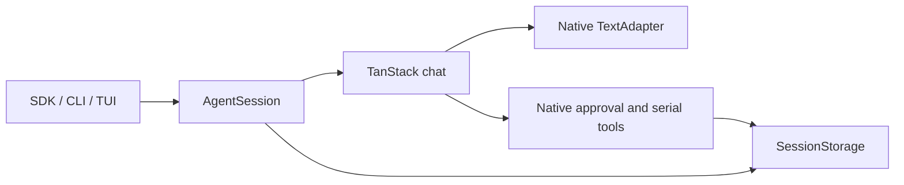

# Forge Agent

[](https://github.com/L-1ngg/forge-agent/actions/workflows/ci.yml)
[](LICENSE)

**A general-purpose single-agent framework, currently under personal development.**

Forge Agent builds a single-agent foundation on TanStack AI, with explicit input ownership, turn outcomes, incremental persistence, and context management. It provides an embeddable Bun SDK and a terminal application. Use the CLI for coding tasks, assemble tools and prompts through the SDK, or fork the project to build a specialized agent.

[简体中文](README.zh-CN.md) · [SDK guide](docs/sdk.en.md) · [Contributing](CONTRIBUTING.md)

## Current Capabilities

- **Execution and session control:** input ownership, turn outcomes, permissions, invocation-scoped steering and follow-ups, cancellation, and incremental v4 session persistence around model streaming and tool execution.
- **Long tasks:** automatic or manual context compaction and bounded overflow recovery; provides sourced task notes, branch history search, and original-text retrieval. Read/Bash provide bounded previews and temporary command logs.
- **Embeddable SDK:** independent instances with native TanStack adapters and host-provided tools, prompts, permissions, and storage. CLI and SDK share the same execution path.
- **Coding CLI:** read, write, edit, and shell tools; interactive TUI or JSON event output for scripts.
- **Terminal interface:** streaming transcript, tool and diff views, permission cards, queued input, and a cell-based renderer.

[TanStack AI](https://tanstack.com/ai) provides the `chat()` model/tool loop, middleware, tool definitions, and native provider adapters. Forge owns session behavior, permissions, the built-in model catalog, authentication, and cost helpers. The local Pi runtime and `pi-ai` dependency have been removed. Models requiring Mistral Conversations or Codex Responses are absent from the built-in catalog because there is no equivalent built-in transport. Research and report generation are planned extensions.

## Quick Start

Requirements: **Bun 1.3.12** and a model provider account. Automated validation targets Linux and macOS; native Windows and Node.js are not supported targets yet.

```bash
git clone https://github.com/L-1ngg/forge-agent.git
cd forge-agent
bun install --frozen-lockfile

# Example: xAI. Set the key in your shell environment before running.
export FORGE_AGENT_PROVIDER=xai
export FORGE_AGENT_MODEL=grok-4.6
bun run forge-agent
```

Set `FORGE_AGENT_API_KEY` through your environment or use the provider's native variable, such as `XAI_API_KEY` or `OPENAI_API_KEY`. Never commit credentials. Built-in model identifiers come from Forge's pinned catalog snapshot; supported models use TanStack transport.

For headless JSON events:

```bash
bun run forge-agent -- -p "Read package.json and summarize it" --json
```

Configuration loads from `~/.config/forge-agent/config.json` (or `$XDG_CONFIG_HOME/forge-agent/config.json`), then `.forge-agent/config.json`, then `FORGE_AGENT_PROVIDER`, `FORGE_AGENT_MODEL`, and `FORGE_AGENT_API_KEY`. CLI flags override provider/model selection. A project configuration can reference an environment variable:

```json
{
  "provider": "xai",
  "model": "grok-4.6",
  "apiKey": "$FORGE_AGENT_API_KEY"
}
```

Optional `baseUrl` points the CLI at a compatible proxy. Keys are case-sensitive and unknown top-level fields are rejected. Each launch starts a new conversation. Nothing is saved until the first message is consumed; conversation files then live under `.forge-agent/sessions/` at the Git worktree root (or the launch directory outside Git). `--session` and the `sessionPath` config key have been removed; use `/resume` to reopen history.

- `/clear` clears the visible transcript and keeps the current model context, with an explicit notice.
- `/new` starts an independent conversation with the current model, tools and configuration. During a task it cancels and waits for tool/persistence cleanup before switching; a save failure stops the switch.
- `/resume` lists this project's conversations by recent activity, prioritizing the first question as the title alongside a short timestamp; textless sessions use a placeholder. Up/Down selects; `Ctrl+E` expands up to six recent user/assistant excerpts on demand; `PgUp/PgDn` or the mouse wheel scrolls. `Esc` collapses the preview, then exits the list; `Enter` resumes. Moving selection collapses the preview. Browsing and previewing make no model calls or session writes and do not interrupt a running task; selecting another conversation does.
- Each preview message contains up to 500 characters with an omission marker. Images use placeholders, and interrupted/failed replies retain status labels. Resume to read the full history. Unchanged list metadata and up to 20 previews in the current picker are cached in memory, checking file changes on subsequent requests; cold loading still depends on history size.
- A Git worktree and its subdirectories share history; separate worktrees are isolated. Existing default `.forge-agent/session.jsonl` files in the project remain discoverable and are never overwritten or automatically converted.
- Unsent text and queued input from saved conversations are kept in memory for this process. Returning to the conversation restores them as an editable draft, without sending. They are not saved on exit. To switch while retaining editor text, put `/new` or `/resume` on a separate first line; an empty conversation with a draft asks before discarding it (`y` confirms, `n` or Esc cancels).

Restoring a conversation rebuilds its history and model context; it does not replay interrupted tools. Tools must cooperate with cancellation; switching can wait for their cleanup. A damaged conversation is reported and requires a verified copy using the SDK conversion workflow before it can be resumed.

## MCP servers

Forge can connect to local stdio and remote Streamable HTTP or legacy SSE MCP servers. Tools use the existing permission pipeline; Resources, URI templates, Prompts, OAuth, and form/URL elicitation are available through the SDK and `/mcp`. Configure `mcp.servers` in `.forge-agent/config.json` or the user configuration; a project definition replaces the entire server with the same ID.

```json
{
  "mcp": {
    "servers": {
      "files": { "transport": "stdio", "command": "your-mcp-server", "args": [] },
      "remote": { "transport": "http", "url": "https://example.com/mcp", "auth": { "type": "oauth", "scopes": ["read"] } }
    }
  }
}
```

`bun run forge-agent -- --mcp 'status'` needs no model credentials. Use `/mcp login remote` for explicit browser authorization, `/mcp resources files` to browse, and `/mcp use-prompt files review --args '{"topic":"change"}' -- Review this change` to submit a Prompt as context. `--no-mcp` disables connections. Persistent CLI changes require `--mcp 'disable files --scope project'` (or `user`); TUI enable/disable without a scope affects the current Agent.

CLI credentials use the system credential store. Linux requires Secret Service by default; explicitly selecting `mcp.credentialStore: "linux-keyutils"` saves credentials within the current Linux/WSL instance and may require login again after a system restart. There is no silent fallback. SDK stores default to instance-local memory. See [SDK MCP contracts](docs/sdk.en.md#mcp), the runnable [catalog example](examples/mcp-client.ts), and [current acceptance evidence](docs/phases/mcp-client-acceptance.md) for tested behavior and remaining external validation.

## Local Skills

The CLI discovers `SKILL.md` directories under `<project>/.forge/skills`, `~/.forge/skills`, and the bundled `packages/cli/builtin_skills` collection (currently empty), in that priority order. `<project>` is the current Git worktree root, or the startup directory outside Git. Existing `.forge-agent` configuration and sessions stay in their current locations.

```text
/skills
/skills reload
/skill code-review Review this patch.
```

Use `/skills` to inspect available and shadowed entries. `/skill` supports name completion; press Enter to accept a suggestion, then type the task. It preserves the task text and loads instructions before submitting a single user input. Rejected inputs return to the editable draft. `--json -p '/skills'`, `--json -p '/skills reload'`, and `--json -p '/skill code-review Review this patch.'` use the same behavior in headless mode. Management commands do not call a model or create conversation history; startup still requires configured provider/model credentials.

The model initially sees only names and descriptions through TanStack AI `withSkills`, then uses its `load_skill` tool to read a selected body. `disable-model-invocation: true` hides a skill from automatic selection while allowing explicit `/skill` invocation. The official `read_skill_resource` tool reads bundled files under `references/` or `assets/`. Loading never executes scripts, installs dependencies, or grants permissions through `allowed-tools`. Skills tools have a trusted source and run without interactive approval, including under `deny-all`. Script commands still use ordinary tools and permissions.

TanStack `skillDirectory` handles discovery and metadata validation; malformed entries are skipped under its rules. The project source precedes the personal source, and the official first-wins combiner resolves names. `/skills reload` refreshes the sources. An accepted Skills change applies after the current `chat()` run; later runs can reload instructions after context compaction. Final request limits include the injected catalog and tools.

Disable with `--no-skills` or configure overrides in `.forge-agent/config.json` (relative paths resolve from startup cwd):

```json
{
  "skills": {
    "enabled": true,
    "roots": { "workspace": "./team-skills", "user": "/home/alice/shared-skills" }
  }
}
```

Missing defaults are empty; a missing explicit override is an error. Set `enabled` to `false` to stop discovery and remove the catalog and loading tool. The SDK is disabled by default and accepts explicit roots; see [Skills](docs/sdk.en.md#skills) and [ADR-026](docs/decisions/026-native-skills-and-markdown-memory.md).

## Persistent Memory

Persistent memory uses ordinary Markdown topics and a short `MEMORY.md` index. TanStack `memoryMiddleware` recalls the index at run start and defers an additional model call to organize a completed turn; useful changes are then written to local Markdown. Current requests and authoritative project documents take precedence over notes; saved notes do not grant permission. Current organizer validation is documented in [Issue #42](docs/phases/memory-organizer-issue-42.md); the original integration and its evidence remain in the [Issue #37 record](docs/phases/tool-ecosystem-issue-37.md).

The CLI enables memory injection and deferred updates by default. You can disable them independently. Memory management tools are internal and do not prompt for permission, including under `permissionMode: "deny-all"`; ordinary file and shell tools still follow their permission policy.

Use `/memory` for help and directory locations. Examples:

```text
/memory list
/memory save project workflow.md Use Bun for this project.
/memory read project workflow.md
/memory edit project workflow.md Use Bun for local development; production is undecided.
/memory pin project workflow.md
/memory sources project workflow.md
/memory read project workflow.md
/memory delete project workflow.md
```

`save`, `edit`, and `delete` operate directly on Markdown files, without a read-version protocol. Plain Markdown can also be edited in your editor. `search <scope> <words>` searches unindexed notes; `read <scope> <path> <offset>` continues a page using its `nextOffset`. `unpin` removes a pin. `import <session-path>` explicitly imports a bounded excerpt from one current-project conversation for model-assisted organization; startup never scans history for memory.

Files live under `$XDG_DATA_HOME/forge-agent/memory` (default `~/.local/share/forge-agent/memory`), outside the Git checkout. User preferences are separate from project notes. A new worktree copies the main worktree's project Markdown once, then evolves independently. Later edits, deletions and Git merges do not synchronize copies. Deleting a note does not delete session history.

`memory.autoUpdate` and `memory.injection` independently control deferred organization and run-start recall. `/memory auto off` and `/memory inject off` change those settings for the current process and apply to the current Agent after its active run. Explicit `/memory` management remains available with both off. `--memory 'read project workflow.md'` works without a model. The `memory` save event reports skipped, saved, or failed status and organizer usage when available; a failed organizer does not change the task result. Recall refreshes on the next run. Topic and index writes are independent.

The SDK only uses memory when its host supplies `memory: { store: new LongTermMemory({ project: absoluteDirectory }) }`; see the [SDK guide](docs/sdk.en.md#persistent-memory).

## Context Management

SDK hosts can use `transformContext` to select, shorten, or inject request messages without changing durable history. Task requests pass a final input/output budget check even when automatic compaction is disabled; output limits are not automatically reduced. See [host context transformation](docs/sdk.en.md#host-context-transformation) for callback lifecycle, built-in transport limits, and estimation boundaries.

CLI and SDK use context compaction by default, including short task notes, history search/read, and request budgets. No opt-in is required. The following optional configuration makes the defaults explicit:

```json
{
  "context": {
    "enabled": true
  }
}
```

SDK `createAgent` also uses context compaction when `context` is omitted or empty. Existing CLI processes must be restarted to load the new default and configuration. No model change is required.

Context compaction sends concise task states and evidence IDs to the model while retaining full evidence in session history and checkpoints. The model can use `search_context` to locate records in the current branch, then `read_context` to retrieve original text. Both tools follow existing permissions and never replay historical tools. Compaction enforces input/output budgets and bounded rebuild attempts. Old pi sessions reconstruct their model context from original branch history; failures do not silently fall back to pi. The old pi strategy and `context.strategy` selector have been removed.

Context compaction does not guarantee lower token use or cost for every task. The initial [real-model comparison](docs/phases/adaptive-context-compaction-acceptance.md) and the later [software checks and material-size estimates](docs/phases/context-notes-search.md) for short notes/search are separate evidence; the new projection has not yet received a fresh real-model quality and total-cost evaluation. See the [SDK context guide](docs/sdk.en.md#context-management) for settings, permissions, and compatibility.

## Embed an Agent

Packages are **private workspace packages**, not published npm packages. Inside this monorepo, declare `"@forge-agent/core": "workspace:*"` in the consuming package and import `@forge-agent/core/sdk`. Repository-root examples use relative imports:

```ts
import { createAgent } from "./packages/core/src/sdk.ts";

const agent = await createAgent({
  provider: "xai",
  model: "grok-4.6",
  ...(process.env.FORGE_AGENT_API_KEY ? { apiKey: process.env.FORGE_AGENT_API_KEY } : {}),
  systemPrompt: "Answer concisely.",
  cwd: process.cwd(),
});
try {
  for await (const event of agent.runTurn("Hello")) {
    if (event.type === "message_delta" && event.contentType === "text") {
      process.stdout.write(event.delta);
    }
  }
} finally {
  await agent.dispose();
}
```

The runnable [SDK quickstart](examples/sdk-quickstart.ts) contains the minimal example above. The SDK starts with in-memory history and no coding tools. The [custom-tool example](examples/embedded-agent.ts) supplies an explicit tool and permission rule:

```bash
bun examples/embedded-agent.ts
```

This example reads `FORGE_AGENT_PROVIDER`, `FORGE_AGENT_MODEL`, and optional `FORGE_AGENT_API_KEY` / `FORGE_AGENT_BASE_URL`. See [storage, permission handling, and lifecycle](docs/sdk.en.md) before embedding it in a long-lived application.

To try the SDK without credentials or model traffic, run the native adapter examples:

```bash
bun examples/custom-adapter.ts
bun examples/turn-policy.ts
bun examples/context-transform.ts
```

The [adapter example](examples/custom-adapter.ts) exercises the production execution path. Custom adapters are shared by task and summary requests; see the [adapter contract](docs/sdk.en.md#native-tanstack-model-adapters) for cancellation, configuration, and migration.

Assistant replies render Markdown in both the transcript and detail view, including tables and code highlighting. Narrow tables switch to labelled records; long code lines wrap with a continuation marker. Forge copy actions preserve Markdown source. LaTeX remains literal. To try a fixed sample without a model or saved session, run `bun scripts/markdown-preview.ts`.

## OpenTelemetry

The CLI exports traces through the official TanStack OTel middleware when an OTLP endpoint is configured:

```bash
OTEL_EXPORTER_OTLP_ENDPOINT=http://localhost:4318 \
OTEL_SERVICE_NAME=forge-agent \
bun run forge-agent --json -p "Inspect this project"
```

CLI export uses OTLP HTTP/JSON. The general endpoint appends `/v1/traces`; `OTEL_EXPORTER_OTLP_TRACES_ENDPOINT` overrides it with an exact URL. The official exporter also reads standard OTLP headers and timeout variables, and resource detection reads `OTEL_RESOURCE_ATTRIBUTES` / `OTEL_SERVICE_NAME` (default `forge-agent`). Set `OTEL_SDK_DISABLED=true` to disable export. Without an endpoint, telemetry is off. Normal exit waits for provider shutdown; failed delivery does not change the task result or JSON stdout. Forced termination can lose buffered spans.

Content capture is off by default. `FORGE_OTEL_CAPTURE_CONTENT=true` explicitly includes prompts, replies, and tool arguments/results; exceptions may contain text even when capture is off. The CLI exports traces only. SDK hosts can provide their own tracer and optional meter through `createAgent({ otel })`, including redaction and the official callbacks. Task, summary, and memory calls are tagged separately; approval resumes correlate native run IDs. See the [SDK guide](docs/sdk.en.md#opentelemetry) and runnable offline [OTel example](examples/otel.ts).

## Architecture

| Package | Responsibility |
|---|---|
| `@forge-agent/protocol` | Events, requests, responses, and presentation data |
| `@forge-agent/core` | Session lifecycle, TanStack chat integration, model adapters, permissions, context, and SDK |
| `@forge-agent/tools` | Tool contracts and built-in coding tools |
| `@forge-agent/tui` | Cell compositor and terminal interaction; protocol, Node built-ins, and pure Markdown/highlighting dependencies |
| `@forge-agent/cli` | Configuration, credentials, tool/storage assembly, and TUI/headless entrypoints |

The dependency gate keeps UI dependencies out of the core and rejects `pi-ai` dependencies and imports. Team orchestration, message routing, and multi-agent dashboards belong to external host projects.

SDK, CLI, and TUI share one `AgentSession`. It owns input queues, configuration snapshots, authoritative outcomes, and session history. TanStack `chat()` owns model/tool continuation, schema validation, approval resume, successful response aggregation, and serial tool execution; request middleware applies context projection and the final budget. Forge checks the raw provider protocol and routes undecided approvals to the host. After the tool batch completes, Forge saves its proposal and results before the next model request. A save failure stops execution and faults the instance, but effects may already exist; a crash may lose the latest batch. Approval resumes within the current process only. See [ADR-030](docs/decisions/030-native-arguments-and-conversation-persistence.md) for the simplified contract.



Original `SessionMessage` history and evidence checkpoints remain the recoverable state. A single request/response projection connects them to TanStack messages; there is no second runtime history or compatibility loop. The SDK accepts native adapters through `adapter`; the former `StreamFn` interface is removed. Existing JSONL, Markdown memory, and MCP attachments retain their formats. See the [SDK migration guide](docs/sdk.en.md#native-tanstack-model-adapters), [ADR-027](docs/decisions/027-native-tool-approval-and-interruption.md), and [ADR-028](docs/decisions/028-model-response-boundary.md).

## Roadmap

| Horizon | Direction |
|---|---|
| **Now** | Complete TanStack foundation verification and remaining real-task acceptance |
| **Next** | Further tool extensions; source-traceable research and reports |
| **Later** | Further validation of long-task reliability, recovery, and context quality/cost; then service APIs and distribution |

The [development plan](docs/plan.md) (Chinese) is the source of truth for actionable work. These are directions, not release-date commitments.

## Development Status and Limits

This is a personal project under active development. APIs and configuration may change. Automated tests do not imply complete real-provider or manual terminal acceptance.

- Bun SDK only; no npm distribution, stable API guarantee, or process-level sandbox.
- Custom tools must cooperate with cancellation. Tool side effects are not rolled back.
- JSONL storage does not guarantee atomicity under power loss or partial writes. Once a commit starts, cancellation waits for it to settle.
- The TUI uses alt-screen and supports mouse-wheel interaction. Clipboard delivery prefers available native channels; OSC 52 is a terminal-dependent fallback with no delivery guarantee.
- Source prereleases are development snapshots, not installable binaries or production releases.

## Development and Documentation

```bash
bun run check
bun run typecheck:examples
```

`check` includes the formal headless smoke and every registered suite. `test:headless` runs that smoke alone. See [Contributing](CONTRIBUTING.md#local-checks) for platform requirements, focused groups, and per-run evidence. Its [scripts and examples guide](CONTRIBUTING.md#scripts-and-examples) distinguishes offline commands from live model experiments.

[SDK guide](docs/sdk.en.md) · [中文 SDK 指南](docs/sdk.md) · [Contributing](CONTRIBUTING.md) · [Internal documentation](docs/README.md) (Chinese)

Maintainers can create [source prerelease drafts](docs/release.md) after dual-platform verification. Publishing a draft is a separate manual step.

Design references: [pi](https://github.com/earendil-works/pi) and [grok-build](https://github.com/xai-org/grok-build). Their licenses apply to their own code.

## License

[MIT](LICENSE), copyright 2026 L1ngg.
