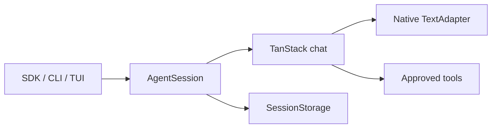

# Forge Agent

[](https://github.com/L-1ngg/forge-agent/actions/workflows/ci.yml)
[](LICENSE)

**An extensible single-agent toolkit for the terminal and your applications.**

Use Forge to explore a codebase, edit files, run commands, and continue work across sessions. Embed the same agent in a Bun application with your own tools, prompts, permissions, and storage, or fork it to build a specialized agent.

Forge includes an interactive terminal, tool approvals, context compaction, and Markdown memory. Skills provide reusable task instructions, and MCP connects external tools and resources. It is built on [TanStack AI](https://tanstack.com/ai) and is under active personal development.

[简体中文](README.zh-CN.md) · [Quick start](#quick-start) · [CLI guide](docs/cli.en.md) · [SDK guide](docs/sdk.en.md) · [Contributing](CONTRIBUTING.md)

## Quick Start

You need **Bun 1.3.12**, Linux or macOS, and access to a supported model provider. Run from source:

```bash
git clone https://github.com/L-1ngg/forge-agent.git
cd forge-agent
bun install --frozen-lockfile

# Example: xAI. Replace the placeholder with your API key.
export FORGE_AGENT_PROVIDER=xai
export FORGE_AGENT_MODEL=grok-4.6
export FORGE_AGENT_API_KEY="your-api-key"
bun run forge-agent
```

Enter a task in the terminal:

```text
Explain how this repository is organized and how to run its checks.
```

Forge shows model output and tool activity as it works, and asks for approval when a tool call needs your decision. See the [CLI guide](docs/cli.en.md#configuration) for other providers, compatible proxies, and configuration files. Keep credentials out of Git.

## Using Forge

The terminal displays streaming replies, tool results, diffs, and permission requests. You can browse earlier output while a task runs and queue your next message. Markdown replies include tables and code highlighting.

| What you want to do | Action |
|---|---|
| Start an independent conversation | `/new` |
| Continue a saved conversation in this project | `/resume` |
| Clear the display while keeping model context | `/clear` |
| Inspect skills, memory, or MCP connections | `/skills`, `/memory`, `/mcp status` |
| See available commands | `/help` |

For scripts, use JSON event output:

```bash
bun run forge-agent --json -p "Read package.json and summarize it"
```

Headless mode declines requests that require a person and reports a distinct exit code. The [CLI guide](docs/cli.en.md) covers running in another project, keyboard shortcuts, session recovery, permissions, and automation.

## Embed an Agent

Use the SDK to run an agent inside a Bun application without starting the TUI. Packages are currently private workspaces in this repository; they are not published to npm. This example runs from the repository root:

```ts
import { createAgent } from "./packages/core/src/sdk.ts";

const agent = await createAgent({
  provider: "xai",
  model: "grok-4.6",
  ...(process.env.FORGE_AGENT_API_KEY ? { apiKey: process.env.FORGE_AGENT_API_KEY } : {}),
  systemPrompt: "Answer concisely.",
  cwd: process.cwd(),
});
try {
  for await (const event of agent.runTurn("Hello")) {
    if (event.type === "message_delta" && event.contentType === "text") {
      process.stdout.write(event.delta);
    }
  }
} finally {
  await agent.dispose();
}
```

Run the matching example with `bun examples/sdk-quickstart.ts` after configuring credentials. Workspace consumers declare `"@forge-agent/core": "workspace:*"` and import `@forge-agent/core/sdk`.

The SDK starts with in-memory history and no coding tools. Supply the tools, storage, and permission handling your application needs. See the [SDK guide](docs/sdk.en.md), [custom-tool example](examples/embedded-agent.ts), and [custom-adapter example](examples/custom-adapter.ts). The adapter example runs without credentials or model traffic.

## Configuration and Extensions

Choose the part you want to customize:

| Need | Entry point |
|---|---|
| Select a model, proxy, or cache hints | [CLI configuration](docs/cli.en.md#configuration); [native SDK adapters](docs/sdk.en.md#native-tanstack-model-adapters) |
| Add tools or control their permissions | [SDK tools and assembly](docs/sdk.en.md#assembly-and-customization-boundaries); [CLI permission modes](docs/cli.en.md#tool-permissions) |
| Reuse task instructions and supporting files | [Local Skills](docs/cli.en.md#skills) |
| Connect external tools, resources, or prompts | [MCP servers](docs/cli.en.md#mcp-servers) |
| Keep preferences and project notes between sessions | [Markdown memory](docs/cli.en.md#memory) |
| Manage context during longer tasks | [Context management](docs/cli.en.md#context-management) |
| Export model and tool traces | [OpenTelemetry](docs/cli.en.md#opentelemetry) |

The CLI discovers local Skills and enables memory recall, deferred memory updates, and context compaction by default. Memory updates can make an additional model call. The SDK enables compaction by default; Skills and memory require host configuration. Each feature's guide explains its settings and limits.

## Architecture

The CLI, TUI, and SDK share one `AgentSession`. Forge manages input, configuration, permissions, session history, and context. TanStack AI owns the model/tool loop and provider adapters.



| Package | Responsibility |
|---|---|
| `@forge-agent/protocol` | Events, requests, responses, and shared data |
| `@forge-agent/core` | Agent sessions, model integration, permissions, context, and SDK |
| `@forge-agent/tools` | Tool contracts and built-in coding tools |
| `@forge-agent/interaction` | Session coordination, input, and management operations |
| `@forge-agent/tui` | Terminal rendering and interaction |
| `@forge-agent/cli` | Configuration, credentials, tools, storage, and launch modes |

Core has no UI dependency. Team orchestration and multi-agent dashboards belong in host applications. See [execution responsibilities](docs/sdk.en.md#execution-responsibilities) for lifecycle and persistence contracts, and the [internal architecture docs](docs/README.md) for design decisions.

## Project Status and Roadmap

Forge is a personal project under active development. APIs and configuration may change.

- The current runtime target is Bun on Linux and macOS. Native Windows and Node.js compatibility are not promised.
- Packages remain private. Source prereleases are development snapshots, not installable binaries or production releases.
- Tool permissions do not provide a process sandbox. Tool effects are not rolled back, and cancellation depends on tool cooperation.
- Session history is saved incrementally; JSONL storage does not guarantee crash or power-loss atomicity. Reopening a session does not replay unfinished tools.
- Automated tests do not establish complete real-provider coverage, long-term task quality, or lower model costs.

Current priorities are real-provider and MCP validation, followed by research workflows and further long-task testing. Service APIs and distribution come later. The [development plan](docs/plan.md) (Chinese) tracks actionable work without release-date commitments.

## Development and Documentation

After installing dependencies, run:

```bash
bun run check
bun run typecheck:examples
```

These checks use local fixtures and require no model credentials. [Contributing](CONTRIBUTING.md#local-checks) explains platform requirements, focused tests, and per-run evidence.

- [CLI guide](docs/cli.en.md) — everyday use, configuration, sessions, and extensions.
- [SDK guide](docs/sdk.en.md) — embedding, tools, storage, permissions, and lifecycle.
- [Scripts and examples](CONTRIBUTING.md#scripts-and-examples) — runnable examples and which commands call real models.
- [Internal documentation](docs/README.md) — architecture decisions, plans, and verification records, in Chinese.
- [Release guide](docs/release.md) — maintainers' source prerelease workflow.

Design references include [Pi](https://github.com/earendil-works/pi) and [grok-build](https://github.com/xai-org/grok-build).

## License

[MIT](LICENSE), copyright 2026 L1ngg.
