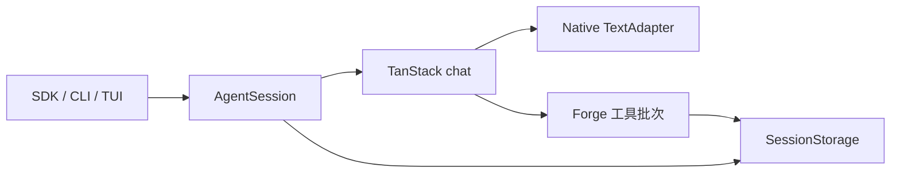

# Forge Agent

[](https://github.com/L-1ngg/forge-agent/actions/workflows/ci.yml)
[](LICENSE)

**通用单 Agent 项目,目前处于个人开发中。**

Forge Agent 基于 TanStack AI 构建通用单 Agent 基座，处理输入归属、执行终态、逐步持久化和上下文管理，并提供可嵌入的 Bun SDK 与终端应用。可以直接用 CLI 完成 coding 任务,通过 SDK 装配工具与提示词,或 fork 后构建专用 Agent。

[English](README.md) · [SDK 接入](docs/sdk.md) · [贡献说明](CONTRIBUTING.md)

## 当前能力

- **执行与会话控制:**围绕模型流与工具执行处理输入归属、执行终态、权限、单次 invocation 内的 steering/follow-up、取消与 v4 会话逐步保存。
- **长任务:**自动或手动上下文压缩、有限超限恢复；提供带证据的短检查点、分支历史搜索与原文找回。Read/Bash 提供有限预览与命令临时日志。
- **可嵌入 SDK:**实例独立,接受 TanStack 原生 adapter，工具、提示词、权限和存储由宿主提供;CLI 与 SDK 复用同一执行路径。
- **Coding CLI:**读取、写入、编辑和 shell 工具,支持交互 TUI 与 JSON 事件输出。
- **终端界面:**流式 transcript、工具和 diff 展示、权限卡片、输入排队、自有 cell renderer。

[TanStack AI](https://tanstack.com/ai) 提供 `chat()` 模型/工具循环、middleware、工具定义和原生供应商 adapter；Forge 维护会话行为、权限、内置模型目录、认证与费用辅助函数。本地 Pi runtime 与 `pi-ai` 依赖已删除。缺少内置等价传输的 Mistral Conversations 和 Codex Responses 模型不在内置目录中。资料调研与报告是后续扩展方向。

## 快速开始

需要 **Bun 1.3.12** 和模型供应商账号。自动化验证面向 Linux/macOS;尚未承诺原生 Windows 或 Node.js 支持。

```bash
git clone https://github.com/L-1ngg/forge-agent.git
cd forge-agent
bun install --frozen-lockfile

# 以 xAI 为例,运行前在 shell 环境中配置密钥。
export FORGE_AGENT_PROVIDER=xai
export FORGE_AGENT_MODEL=grok-4.6
bun run forge-agent
```

使用 `FORGE_AGENT_API_KEY` 或供应商原生变量(如 `XAI_API_KEY`、`OPENAI_API_KEY`)传入密钥,不要提交凭据。内置模型标识符来自 Forge 固定的目录快照；受支持的模型走 TanStack 传输。

Headless JSON 事件输出:

```bash
bun run forge-agent -- -p "Read package.json and summarize it" --json
```

配置依次加载 `~/.config/forge-agent/config.json`(设置 XDG 时为 `$XDG_CONFIG_HOME/forge-agent/config.json`)、`.forge-agent/config.json`、`FORGE_AGENT_PROVIDER` / `FORGE_AGENT_MODEL` / `FORGE_AGENT_API_KEY`。CLI 参数覆盖 provider/model 选择。项目配置可以引用环境变量:

```json
{
  "provider": "xai",
  "model": "grok-4.6",
  "apiKey": "$FORGE_AGENT_API_KEY"
}
```

可选 `baseUrl` 指向兼容代理。字段区分大小写,未知顶层字段会被拒绝。每次启动进入新会话，首次输入被消费前不保存；之后写入 Git worktree 根目录的 `.forge-agent/sessions/`，非 Git 项目则使用启动目录。已移除 `--session` 和配置 `sessionPath`，通过 `/resume` 恢复历史。

- `/clear` 只清空可见对话，保留模型上下文并明确提示。
- `/new` 开始独立会话，沿用当前模型、工具和配置。任务执行中会先取消并等待工具和保存收尾，再切换；保存失败则停止切换。
- `/resume` 列出当前项目会话，按最近活动排序，优先显示首条提问作为标题及简短时间；无文本时显示占位。↑/↓ 选择，`Ctrl+E` 按需展开最近最多 6 条用户/助手原文，`PgUp/PgDn` 或滚轮滚动。预览中的 `Esc` 先收起，再按退出列表；`Enter` 恢复。移动选择会收起预览。浏览与展开不调用模型、不保存会话，也不会中断当前任务；选定另一个会话才会。
- 预览每条最多 500 个字符并标记省略，图片显示占位，中断/失败保留状态提示；完整历史在恢复后查看。未变化文件的列表信息及本次选择器中最多 20 份预览使用内存缓存，再次请求时检查文件变化；冷加载仍可能受历史大小影响。
- 同一 Git worktree 的根目录与子目录共享历史，不同 worktree 隔离。项目内已有的默认 `.forge-agent/session.jsonl` 仍可发现，不自动覆盖或转换。
- 已保存会话的未发送文本和排队输入在当前进程内暂存，返回原会话时恢复为可编辑草稿，不自动发送；退出后不保存。要携带编辑中的草稿发起切换，可在独立首行放置 `/new` 或 `/resume`；空会话有草稿时会提示丢弃确认（`y` 确认，`n` 或 Esc 取消）。

恢复会话重建历史和模型上下文，不重放中断工具。工具需要配合取消，切换会等待其收尾。损坏会话会报告诊断，需按 SDK 的副本转换流程检查后恢复。

## 本地 Skills

CLI 按工作区 → 用户 → 内置的优先级发现 `<project>/.forge/skills`、`~/.forge/skills`、产品随附 `packages/cli/builtin_skills`（本轮为空）中的 `SKILL.md` 目录。`<project>` 是当前 Git worktree 根，无 Git 时为启动目录；既有 `.forge-agent` 配置、会话与记忆路径不迁移。

```text
/skills
/skills reload
/skill code-review 请审查当前补丁。
```

`/skills` 查看有效与遮蔽项；`/skill` 提供名称补全，按 Enter 接受候选后输入任务。正文准备成功后只提交一次用户输入，任务文本保留原文，失败输入返还编辑草稿。headless 支持 `--json -p '/skills'`、`--json -p '/skills reload'` 和 `--json -p '/skill code-review 请审查当前补丁。'`。管理命令不请求模型、不创建对话历史；启动仍需配置 provider/model 凭据。

模型通过 TanStack AI `withSkills` 初始只看到名称和用途，再以其 `load_skill` 按需读取正文。`disable-model-invocation: true` 禁止自动选用，但允许显式 `/skill`。官方 `read_skill_resource` 读取 `references/` 或 `assets/` 下的资料。加载不执行脚本、不安装依赖，`allowed-tools` 不产生授权。Skills 工具作为 internal 工具进入普通批次和 hooks，不触发交互授权，`deny-all` 下也是如此；脚本命令仍走普通工具权限。

目录发现和元数据校验由 TanStack `skillDirectory` 负责，坏项按其规则跳过。项目来源先于个人来源，官方 first-wins 组合器处理同名项。`/skills reload` 刷新来源。Skills 变更在当前 `chat()` 结束后 applied；上下文压缩后的新运行仍可重新加载指引。最终请求上限包含注入的目录和工具。

`--no-skills` 可关闭；也可在 `.forge-agent/config.json` 覆盖来源（相对路径以启动 cwd 解析）：

```json
{
  "skills": {
    "enabled": true,
    "roots": { "workspace": "./team-skills", "user": "/home/alice/shared-skills" }
  }
}
```

默认根缺失为空；显式覆盖缺失报错。设 `enabled: false` 后不扫描、不注入目录、不注册加载工具。SDK 默认关闭并要求宿主提供 roots，见 [Skills 接入](docs/sdk.md#skills)及 [ADR-026](docs/decisions/026-native-skills-and-markdown-memory.md)。

## 持久记忆

持久记忆采用普通 Markdown 主题与简短的 `MEMORY.md` 索引。TanStack `memoryMiddleware` 在运行开始召回索引，在成功结束后 deferred 调用现有模型整理本轮内容，再将有价值的变化写入本机 Markdown。当前要求和项目权威资料优先于旧笔记，记忆不扩大权限。当前实现与验收证据见 [Issue #37 施工记录](docs/phases/tool-ecosystem-issue-37.md)。

CLI 默认启用记忆注入与 deferred 更新，可分别关闭。记忆管理工具是 internal 工具，`permissionMode: "deny-all"` 下也不触发交互授权；普通文件和 shell 工具仍受权限策略约束。

`/memory` 显示帮助和目录位置，例如：

```text
/memory list
/memory save project workflow.md 本项目使用 Bun。
/memory read project workflow.md
/memory edit project workflow.md 本地开发使用 Bun；production 尚未决定。
/memory pin project workflow.md
/memory sources project workflow.md
/memory read project workflow.md
/memory delete project workflow.md
```

`save`、`edit`、`delete` 直接操作 Markdown 文件，没有先读版本协议；也可直接用编辑器管理。`search <scope> <words>` 覆盖未入索引的笔记；`read <scope> <path> <offset>` 用返回的 `nextOffset` 继续分页。`unpin` 取消固定。`import <session-path>` 显式、限量读取当前项目的单个会话，由模型整理；启动不会为记忆扫描全部历史。

目录为 `$XDG_DATA_HOME/forge-agent/memory`，缺省 `~/.local/share/forge-agent/memory`，位于 Git 工作区外。用户通用偏好与项目笔记分开。新 worktree 首次使用时复制主 worktree 的项目 Markdown，随后独立维护；后续修改、删除与 Git 合并不自动同步副本。删除记忆不删除会话历史。

配置中的 `memory.autoUpdate` 和 `memory.injection` 分别控制 deferred 整理与运行开始的召回；`/memory auto off`、`/memory inject off` 只改变当前进程，当前 Agent 在本次运行结束后应用。两者关闭时仍可显式管理记忆。`--memory 'read project workflow.md'` 无需模型。`memory` 保存事件报告 skipped、saved 或 failed，并在模型提供时带上整理 usage；整理失败不改写主任务结果。下次运行重新召回，主题与索引分别写入。

SDK 只有在宿主提供 `memory: { store: new LongTermMemory({ project: absoluteDirectory }) }` 时才启用，见 [SDK 指南](docs/sdk.md#持久记忆)。

## 上下文管理

SDK 宿主可通过 `transformContext` 选择、精简或注入本次请求消息，不改变持久历史。任务请求在关闭自动压缩时也经过最终输入/输出预算检查，不自动缩减输出上限。回调生命周期、内置传输限制与估算边界见[宿主上下文变换](docs/sdk.md#宿主上下文变换)。

CLI 与 SDK 默认启用上下文压缩，包括短检查点、历史搜索/读取与请求预算，无需额外开启。以下可选配置只是显式写出默认值：

```json
{
  "context": {
    "enabled": true
  }
}
```

SDK 的 `createAgent` 省略 `context` 或传空对象时也使用上下文压缩。已运行的 CLI 需重启才能加载新默认值和配置，无需更换模型。

上下文压缩向模型提供简短的任务状态和证据 ID，完整证据仍保存在会话历史与检查点中。模型可用 `search_context` 找到当前分支的相关记录，再用 `read_context` 查看原文；两者均受现有权限策略控制，不重新执行历史工具。压缩有输入/输出预算和有限重建次数；旧 pi 会话从原始分支历史恢复模型上下文，失败不自动回退 pi。旧 pi 策略与 `context.strategy` 选择项已删除。

它不保证所有任务都省 Token 或更便宜。首次上下文压缩的[真实模型对照](docs/phases/adaptive-context-compaction-acceptance.md)与后续短检查点/搜索的[软件验证及材料大小估算](docs/phases/context-notes-search.md)是不同证据；新投影尚未重新完成真实模型质量和总费用评估。完整参数、权限和兼容边界见 [SDK 上下文指南](docs/sdk.md#上下文管理)。

## 嵌入 Agent

包是**仓库内私有 workspace 包**,尚未发布 npm。在本 monorepo 的宿主 package 中声明 `"@forge-agent/core": "workspace:*"`,通过 `@forge-agent/core/sdk` 导入。仓库根目录示例使用相对路径:

```ts
import { createAgent } from "./packages/core/src/sdk.ts";

const agent = await createAgent({
  provider: "xai",
  model: "grok-4.6",
  ...(process.env.FORGE_AGENT_API_KEY ? { apiKey: process.env.FORGE_AGENT_API_KEY } : {}),
  systemPrompt: "Answer concisely.",
  cwd: process.cwd(),
});
try {
  for await (const event of agent.runTurn("Hello")) {
    if (event.type === "message_delta" && event.contentType === "text") {
      process.stdout.write(event.delta);
    }
  }
} finally {
  await agent.dispose();
}
```

SDK 默认使用内存历史,不装配 coding 工具。[自定义工具示例](examples/embedded-agent.ts) 显式提供工具和授权规则:

```bash
bun examples/embedded-agent.ts
```

示例宿主读取 `FORGE_AGENT_PROVIDER`、`FORGE_AGENT_MODEL` 及可选的 `FORGE_AGENT_API_KEY` / `FORGE_AGENT_BASE_URL`。长期宿主接入前先读 [存储、权限与生命周期](docs/sdk.md)。

无需凭据或模型请求即可运行原生 adapter 示例：

```bash
bun examples/custom-adapter.ts
bun examples/turn-policy.ts
bun examples/context-transform.ts
```

[adapter 示例](examples/custom-adapter.ts) 使用生产执行链。任务和摘要共用自定义 adapter，取消、配置及旧接口迁移见 [adapter 合同](docs/sdk.md#原生-tanstack-模型-adapter)。

assistant 回复在正文和详情页渲染 Markdown,支持表格与代码高亮。窄表格回退为带列名的记录,长代码行折行并显示续行标记。Forge 的复制操作保留 Markdown 原文,LaTeX 保持原文。可运行 `bun scripts/markdown-preview.ts` 查看固定样例,不调用模型或保存会话。

## 架构

| 包 | 职责 |
|---|---|
| `@forge-agent/protocol` | 事件、请求、响应与展示数据 |
| `@forge-agent/core` | 会话生命周期、TanStack chat 接入、模型适配、权限、上下文与 SDK |
| `@forge-agent/tools` | 工具契约与内置 coding 工具 |
| `@forge-agent/tui` | cell compositor 与终端交互;依赖 protocol、Node 内置模块及纯 Markdown/高亮库 |
| `@forge-agent/cli` | 配置、凭据、工具与存储装配,TUI/headless 入口 |

依赖门禁禁止 core 引入 UI，并拒绝 `pi-ai` 依赖及 import。Team 编排、消息路由、多 Agent dashboard 归外部宿主项目。

SDK、CLI 与 TUI 共用一个 `AgentSession`，由它负责输入队列、配置快照、权威终态和持久历史。TanStack `chat()` 负责模型/工具续轮，请求 middleware 完成上下文投影和最终预算检查。工具通过原生 `toolDefinition().server()` 进入 Forge 批次策略，完成参数校验、权限、执行、结果干预及按序保存。



`SessionMessage` 原文与证据检查点是唯一可恢复状态；它们只在请求/响应边界与 TanStack 消息转换一次，不再维护第二份 runtime 历史或兼容循环。SDK 通过 `adapter` 接受原生 adapter，旧 `StreamFn` 接口已移除；已有 JSONL、Markdown 记忆和 MCP 附件格式保持。迁移见 [SDK 指南](docs/sdk.md#原生-tanstack-模型-adapter)，职责决定见 [ADR-025](docs/decisions/025-tanstack-agent-foundation.md)，当前结果见[验收记录](docs/phases/tanstack-foundation-acceptance.md)。

## Roadmap

| 阶段 | 方向 |
|---|---|
| **Now** | 完成 TanStack 基座验证与剩余真实任务验收 |
| **Next** | 后续工具扩展,来源可追溯的资料调研与报告 |
| **Later** | 长任务可靠性、恢复边界与上下文质量/成本的持续验证,之后是服务 API 与分发 |

[开发规划](docs/plan.md) 是行动项真相源。以上是方向,不承诺发布日期。

## 开发状态与限制

个人持续开发中,API 与配置可能变化。自动化通过不代表完整真实供应商与人工终端验收通过。

- 当前只提供 Bun SDK,不承诺 npm 分发、稳定 API 或进程级沙箱。
- 自定义工具需配合取消;工具副作用不会回滚。
- JSONL 不保证断电或部分写入时的事务性;提交开始后取消需等待结算。
- TUI 使用 alt-screen，支持滚轮交互；剪贴板优先使用可用的原生渠道，OSC 52 为终端相关的回退方式，不保证终端接受。
- 源码预发布是开发快照,不是可安装二进制或生产发行版。

## 开发与文档

```bash
bun run check
bun run test:headless
bun run typecheck:examples
```

`check` 在两平台均使用本地 fixtures、假凭据和独立配置。Linux 额外通过 `unshare` 和 `ip` 强制网络隔离，并需要 Python 3 运行原生网络探针；macOS 运行完整兼容性测试，不启用系统网络隔离或配置防火墙。`test:network` 仅支持 Linux。可用 `test:contract`、`test:integration`、`test:cli` 单独运行各组，报告、耗时及隔离模式保存在 `.test-results/`。`test:live` 是独立显式入口，需要指定目标及请求/时间额度；详见[测试指南](docs/phases/testing-system-implementation.md)。

[中文 SDK](docs/sdk.md) · [English SDK](docs/sdk.en.md) · [贡献说明](CONTRIBUTING.md) · [内部文档](docs/README.md)

维护者可在双平台验证后创建 [源码预发布草稿](docs/release.md),公开发布仍是单独的手动操作。

参考项目:[pi](https://github.com/earendil-works/pi)、[grok-build](https://github.com/xai-org/grok-build)。各自代码适用其上游许可证。

## 许可证

[MIT](LICENSE),copyright 2026 L1ngg。

### MCP 服务

Forge 可连接本地 stdio、远程 Streamable HTTP 和旧版 SSE MCP 服务。Tools 走现有权限流程；SDK 与 `/mcp` 提供 Resources、URI templates、Prompts、OAuth 和 form/URL Elicitation。在 `.forge-agent/config.json` 或用户配置中设置 `mcp.servers`；项目配置按同名 server 整条覆盖。

```json
{
  "mcp": {
    "servers": {
      "files": { "transport": "stdio", "command": "your-mcp-server", "args": [] },
      "remote": { "transport": "http", "url": "https://example.com/mcp", "auth": { "type": "oauth", "scopes": ["read"] } }
    }
  }
}
```

`bun run forge-agent -- --mcp 'status'` 无需模型凭据。`/mcp login remote` 显式启动浏览器授权；`/mcp resources files` 浏览目录；`/mcp use-prompt files review --args '{"topic":"change"}' -- 审查这个变更` 将 Prompt 作为上下文提交。`--no-mcp` 禁止连接。CLI 持久修改使用 `--mcp 'disable files --scope project'`（或 `user`）；TUI 不带 scope 的 enable/disable 只改变当前 Agent。

CLI 凭据默认使用系统凭据库，Linux 要求 Secret Service；显式设置 `mcp.credentialStore: "linux-keyutils"` 时只在当前 Linux/WSL 实例内保存，系统重启后可能需要重新登录，不静默 fallback。SDK 默认使用实例内存存储。具体合同见 [SDK MCP](docs/sdk.md#mcp)，可运行[目录示例](examples/mcp-client.ts)；已测行为和未完成的外部验收见[验收证据](docs/phases/mcp-client-acceptance.md)。
