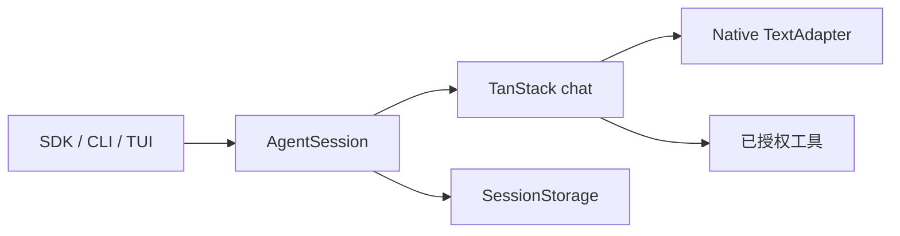

# Forge Agent

[](https://github.com/L-1ngg/forge-agent/actions/workflows/ci.yml)
[](LICENSE)

**可在终端使用、也可嵌入应用的可扩展单 Agent 工具集。**

用 Forge 理解代码库、编辑文件、运行命令，并在不同会话之间继续工作。你也可以把同一个 Agent 嵌入 Bun 应用，装配自己的工具、提示词、权限和存储，或 fork 项目来构建专用 Agent。

Forge 提供交互式终端、工具审批、上下文压缩和 Markdown 记忆，通过 Skills 复用任务指引，通过 MCP 接入外部工具和资源。项目基于 [TanStack AI](https://tanstack.com/ai)，目前由个人持续开发。

[English](README.md) · [快速开始](#快速开始) · [CLI 使用指南](docs/cli.md) · [SDK 接入指南](docs/sdk.md) · [贡献说明](CONTRIBUTING.md)

## 快速开始

需要 **Bun 1.3.12**、Linux 或 macOS，以及可用的模型供应商账号。从源码运行：

```bash
git clone https://github.com/L-1ngg/forge-agent.git
cd forge-agent
bun install --frozen-lockfile

# 以 xAI 为例，将占位内容替换为你的 API key。
export FORGE_AGENT_PROVIDER=xai
export FORGE_AGENT_MODEL=grok-4.6
export FORGE_AGENT_API_KEY="your-api-key"
bun run forge-agent
```

在终端中输入任务：

```text
解释这个仓库的目录结构，以及如何运行它的检查。
```

Forge 会显示模型输出和工具执行过程，需要你决定的工具调用会弹出审批。其他供应商、兼容代理和配置文件见 [CLI 配置指南](docs/cli.md#配置)。不要把凭据提交到 Git。

## 使用 Forge

终端中可以查看流式回复、工具结果、文件差异和权限请求。任务执行期间可以浏览已有输出，也可以排队提交下一条消息。Markdown 回复支持表格和代码高亮。

| 你想做什么 | 操作 |
|---|---|
| 开始独立对话 | `/new` |
| 继续当前项目的历史会话 | `/resume` |
| 清空显示，保留模型上下文 | `/clear` |
| 查看 Skills、记忆或 MCP 连接 | `/skills`、`/memory`、`/mcp status` |
| 查看可用命令 | `/help` |

在脚本中使用 JSON 事件输出：

```bash
bun run forge-agent --json -p "读取 package.json 并概括它的内容"
```

Headless 模式会拒绝需要人工决定的请求，并返回对应退出码。[CLI 使用指南](docs/cli.md)包含在其他项目中启动、快捷键、会话恢复、权限与自动化的完整说明。

## 嵌入 Agent

通过 SDK 在 Bun 应用内运行 Agent，无需启动 TUI。当前包是仓库内的 private workspace，尚未发布到 npm。下面的示例适用于仓库根目录：

```ts
import { createAgent } from "./packages/core/src/sdk.ts";

const agent = await createAgent({
  provider: "xai",
  model: "grok-4.6",
  ...(process.env.FORGE_AGENT_API_KEY ? { apiKey: process.env.FORGE_AGENT_API_KEY } : {}),
  systemPrompt: "Answer concisely.",
  cwd: process.cwd(),
});
try {
  for await (const event of agent.runTurn("Hello")) {
    if (event.type === "message_delta" && event.contentType === "text") {
      process.stdout.write(event.delta);
    }
  }
} finally {
  await agent.dispose();
}
```

配置凭据后，可用 `bun examples/sdk-quickstart.ts` 运行同一示例。Workspace 内的使用方声明 `"@forge-agent/core": "workspace:*"`，通过 `@forge-agent/core/sdk` 导入。

SDK 默认使用内存历史，不自动装配 coding 工具。按应用需求提供工具、存储和权限处理。详见 [SDK 指南](docs/sdk.md)、[自定义工具示例](examples/embedded-agent.ts)和[自定义 adapter 示例](examples/custom-adapter.ts)；adapter 示例无需凭据，也不请求真实模型。

## 配置与扩展

按需要选择定制入口：

| 需求 | 入口 |
|---|---|
| 选择模型、代理或缓存提示 | [CLI 配置](docs/cli.md#配置)；[SDK 原生 adapter](docs/sdk.md#原生-tanstack-模型-adapter) |
| 添加工具或控制权限 | [SDK 工具与装配](docs/sdk.md#装配与定制边界)；[CLI 权限模式](docs/cli.md#工具权限) |
| 复用任务指引和配套资料 | [本地 Skills](docs/cli.md#skills) |
| 接入外部工具、资源和提示词 | [MCP 服务](docs/cli.md#mcp-服务) |
| 跨会话保留偏好与项目笔记 | [Markdown 记忆](docs/cli.md#记忆) |
| 管理较长任务的上下文 | [上下文管理](docs/cli.md#上下文管理) |
| 导出模型和工具调用 trace | [OpenTelemetry](docs/cli.md#opentelemetry) |

CLI 默认发现本地 Skills，并开启记忆召回、任务结束后的记忆整理和上下文压缩；记忆整理可能额外调用模型。SDK 默认开启上下文压缩，Skills 和记忆需要宿主显式配置。各功能指南说明具体开关与边界。

## 架构

CLI、TUI 和 SDK 共用一个 `AgentSession`。Forge 管理输入、配置、权限、会话历史和上下文，TanStack AI 负责模型与工具续轮及供应商 adapter。



| 包 | 职责 |
|---|---|
| `@forge-agent/protocol` | 事件、请求、响应和共享数据 |
| `@forge-agent/core` | Agent 会话、模型接入、权限、上下文与 SDK |
| `@forge-agent/tools` | 工具契约与内置 coding 工具 |
| `@forge-agent/interaction` | 会话协调、输入和管理操作 |
| `@forge-agent/tui` | 终端渲染与交互 |
| `@forge-agent/cli` | 配置、凭据、工具、存储与启动模式 |

Core 不依赖 UI。Team 编排和多 Agent dashboard 由宿主应用负责。生命周期和持久化合同见 [SDK 执行职责](docs/sdk.md#执行职责)，设计决策见[内部架构文档](docs/README.md)。

## 项目状态与路线

Forge 目前由个人持续开发，API 和配置可能变化。

- 当前运行目标是 Linux、macOS 上的 Bun，暂不承诺原生 Windows 或 Node.js 兼容。
- 包保持 private；源码预发布是开发快照，不是可安装二进制或生产发行版。
- 工具权限不提供进程级沙箱；工具副作用不会回滚，取消需要工具配合。
- 会话历史增量保存，JSONL 不保证崩溃或断电时的事务性；恢复会话不会重放未完成的工具。
- 自动化测试不代表完整真实供应商覆盖、长期任务质量或更低的模型费用。

当前优先完成真实供应商与 MCP 验证，再推进资料调研场景和长任务测试，服务 API 与分发安排在后续。[开发规划](docs/plan.md)维护具体行动项，不承诺发布日期。

## 开发与文档

安装依赖后运行：

```bash
bun run check
bun run typecheck:examples
```

这些检查使用本地 fixtures，无需模型凭据。平台要求、定向测试与每次运行的证据见[贡献说明](CONTRIBUTING.md#local-checks)。

- [CLI 使用指南](docs/cli.md)：日常使用、配置、会话与扩展。
- [SDK 接入指南](docs/sdk.md)：嵌入、工具、存储、权限与生命周期。
- [脚本与示例](CONTRIBUTING.md#scripts-and-examples)：可运行示例，以及哪些命令会请求真实模型。
- [内部文档](docs/README.md)：架构决策、规划与验收记录。
- [发布指南](docs/release.md)：维护者的源码预发布流程。

参考项目包括 [Pi](https://github.com/earendil-works/pi) 和 [grok-build](https://github.com/xai-org/grok-build)。

## 许可证

[MIT](LICENSE)，copyright 2026 L1ngg。
