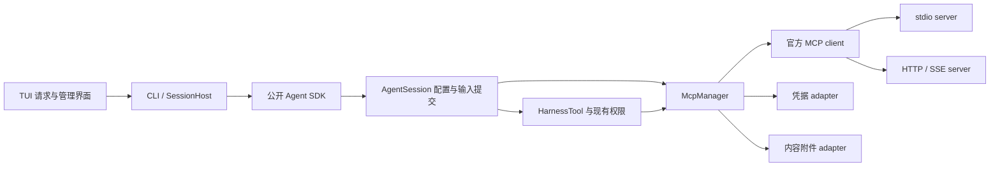

# MCP client 完整施工设计

> 状态:已完成(代码实现与软件验证，2026-09-21)。operator 于 2026-09-21 明确确认现有设计并授权完整生产实现；已接入生产代码；operator 随后在获知未测边界后授权 commit、push 并关闭 Issue。软件与外部验收边界见[验收记录](mcp-client-acceptance.md)。需求范围、任务状态和唯一 AC 清单见 [Issue #36](https://github.com/L-1ngg/forge-agent/issues/36)。架构取舍见 [ADR-022](../decisions/022-mcp-host-integration.md)。
> 一次性交付：本地/远程、Tools、Resources、Prompts、OAuth、Elicitation、SDK/CLI/TUI 及验收共同完成，不分交付批次。下文按职责组织，不代表可以推迟其中任何能力。

## Why

用户需要直接使用 MCP 生态，要求“本地与远程都需要”“一次性全做”“尽可能用官方套件/第三方库”。[路线](../plan.md)中的能力扩展由本设计落实。基线 `e049505f1015623a334b50439daae15ce6e3479b`：已有工具、权限、RequestBus、配置提交和会话存储，没有原生 MCP。

本文件解决具体接口、生命周期、存储、内容投影、交互和验证方法。Issue 的用户故事与 AC 不在这里复制；最后的映射表说明每项验收在哪里获得证据。

## Entry Criteria

| 检查 | 当前证据/施工前要求 | 不通过时 |
|---|---|---|
| 范围一致 | Issue #36 已发布；全部能力共用一个出口 | 不自行删减或转为未来批次 |
| 官方 SDK 可在 Bun 使用 | 独立探针已覆盖 stdio/HTTP、新旧模式、工具/资源/模板、取消与直接子进程关闭，见[探针](../research/mcp-client/README.md) | 具体集成失败先定位，不默认自写协议 |
| schema 与目录快照可接入 | SDK 提供 Ajv、UriTemplate、执行时 `toolDefinition`；仍须 Forge 完整路径验收 | 不用类型断言或丢弃 schema 关键字掩盖问题 |
| 凭据后端 | 本机 keyutils 合成条目跨进程通过；系统 Secret Service 缺失；macOS 尚未测，见[证据](../research/mcp-host-design.md) | 不静默 fallback；选择显式后端或准备系统服务 |
| 设计确认 | operator 于 2026-09-21 已明确确认本文及 ADR-022 | 已满足开工条件 |
| 真实验收条件 | 本地样本可准备；远程只读 OAuth 样本已选，账号/授权与真实模型预算待落实 | 不阻止无凭据的软件实现与 fixture 测试；阻止宣称 AC-26/完整交付通过 |

## What

### 1. 模块与依赖



计划修改/新增位置：

| 位置 | 职责与修改原因 |
|---|---|
| `packages/core/src/mcp/` | `manager.ts` 隐藏连接/目录/状态；`config.ts` 校验与身份；`tools.ts` 工具映射；`content.ts` 内容映射；`oauth.ts` provider；`credentials.ts`/`artifacts.ts` 可变存储 adapter；`types.ts` 公开类型 |
| `packages/core/src/agent.ts`、`sdk.ts`、`agent-session.ts`、`session-assembly.ts` | 显式 MCP 选项、控制接口、创建/失败/释放接线；不导出整个官方 Client |
| `packages/core/src/agent-session.ts`、`configuration.ts`、`session-configuration.ts` | 目录快照提交、连接世代持有、结构化输入准备与一次持久化 |
| `packages/core/src/session-tools.ts`、`packages/tools/src/types.ts` | schema 类型扩大、授权参数一致、MCP 调用仍走同一工具路径 |
| `packages/protocol/src/input.ts`、`events.ts`、`requests.ts` | MCP 输入封套、来源/附件描述、状态及 Elicitation 请求响应；保持无 SDK/native 依赖 |
| `packages/core/src/session-storage.ts`、`event-projection.ts`、`usage.ts`、`context/` | 封套投影、历史/预算一致性；必要转换集中实现，不复制进不同 provider |
| `packages/core/src/config.ts`、`packages/cli/src/mcp-command.ts`、`main.ts`、`session-host.ts` | 沿用配置解析；CLI 增加系统存储/浏览器 adapter 和管理命令，不创建另一套配置框架 |
| `packages/tui/src/app.ts`、`request-card.ts`、`input-router.ts` 及既有 renderer | 管理视图、表单、URL/OAuth 状态；不依赖官方 SDK、keyring 或浏览器库 |
| 现有 SDK/CLI/PTY 测试目录 | 通过公开接入验证；仅外部 server/model/store 使用 fixture |

依赖决策（实现时精确锁定，安装产物变化必须重验）：

| 依赖 | 使用范围 | 复用能力 |
|---|---|---|
| `@modelcontextprotocol/client@2.0.0` | Core MCP | transports、协议版本、分页、OAuth、输出校验、进度、通知、交互轮次；根导出的 `UriTemplate`；`validators/ajv` 的 `AjvJsonSchemaValidator` |
| `@modelcontextprotocol/server@2.0.0` | 开发/测试 | 内存、stdio、HTTP fixtures；真实旧版 server 另锁定 v1 SDK fixture，不将兼容模式误作 v1 证据 |
| `@napi-rs/keyring@2.1.0` | CLI 凭据 adapter，动态加载 | 系统 Keychain/Secret Service 及显式 Linux keyutils；Core 定义接口但不导入 native 库 |
| `proper-lockfile@4.1.2` | CLI 持久凭据 adapter | 多进程刷新互斥，锁仅保存无秘密标识 |
| `open@11.0.4` | CLI 浏览器 adapter | 平台浏览器打开，包括 WSL 分支；失败时显示 URL，不手写 shell 拼接 |

不另外安装 URI 模板或 Ajv 包来复制官方已导出的能力；不引入 AI SDK/mcp-use 的 Agent/宿主管理层。`open` 当前仅完成发布信息核查，运行适配仍须集成验证。

### 2. 配置与默认值

沿用用户 `$XDG_CONFIG_HOME/forge-agent/config.json`（默认 `~/.config/forge-agent/config.json`）与项目 `.forge-agent/config.json`。新增 `mcp`，不迁移 Skills 目录。

```json
{
  "mcp": {
    "enabled": true,
    "credentialStore": "system",
    "servers": {
      "files": {
        "transport": "stdio",
        "command": "bunx",
        "args": ["--no-install", "@modelcontextprotocol/server-filesystem", "./fixtures"],
        "cwd": "..",
        "protocol": "legacy",
        "tools": { "include": ["read_file", "list_directory"] }
      },
      "linear": {
        "transport": "http",
        "url": "https://mcp.linear.app/mcp/readonly",
        "protocol": "auto",
        "auth": { "type": "oauth", "profile": "default", "scopes": ["read"] }
      }
    }
  }
}
```

示例展示配置形状，不要求上述本地包已安装，也不授权 Forge 在启动时自动安装它。`command` 为可执行文件，`args` 为 argv，默认不经 shell；需要 shell 时用户显式配置可执行命令。

- `enabled` 默认 true；未提供 `mcp` 或空 servers 时无连接。server 可单独 `enabled:false`。CLI `--no-mcp` 覆盖本次运行，不写配置。
- server ID 限定 ASCII 字母/数字/`_`/`-`，最长 48 字符。项目同名 server **整条覆盖**用户定义，空/删除与禁用不混同；来源保留用于展示。SDK 接受最终配置，不读取上述文件。
- transport 为 `stdio | http | sse`；protocol 为 `legacy | auto | 2026-07-28`。默认 stdio legacy、HTTP auto、SSE legacy；不允许 SSE + modern。HTTP 不自动将任意错误降级为 SSE；旧 SSE 由用户显式选。
- `cwd` 相对定义它的配置文件所在目录解析；CLI 示例项目路径须相应填写，不能因启动目录变化而漂移。SDK 相对路径基于显式 Agent `cwd`。命令 PATH 由宿主环境决定。
- `env`、`headers` 支持现有 `$VAR`/`${VAR}` 引用；MCP 凭据配置不引入 `!shell-command` 执行语法。缺变量拒绝该 server，诊断不打印值。HTTP auth 为 none、header 或 OAuth，OAuth 与用户手写 Authorization 互斥；显式 header 值不会进入公开快照。
- `tools.include/exclude` 为原工具名的精确集合，exclude 优先；未配置 include 表示该 server 全部兼容工具。不存在的条目显示诊断。目录顺序按 server ID/原名稳定排序。
- `credentialStore` 为 CLI-only 的 `system | linux-keyutils`；SDK 提供接口对象。配置检查不因尚未登录就启动浏览器。
- SDK setEnabled 与 TUI enable/disable 默认仅修改当前实例；需要下次启动保留时使用 `--scope user|project`。独立 CLI `--mcp 'enable|disable ...'` 要求显式 scope，避免命令退出后开关立即失效却误报持久生效。保存时只原子更新目标配置中的对应 server 定义，保留其他字段；project 覆盖用户定义时写完整有效定义和 enabled。外部文件并发变化须拒绝覆盖并提示重读，不静默覆盖用户编辑。

默认限制：连接 15s；版本探测 3s；目录/读资源/取模板 15s；工具调用 60s（进度可延长 inactivity，但总上限 300s）；OAuth/Elicitation 5min；清理 5s（含 SDK 自身退出宽限）；同时连接 4 个 server。可按 server 配置正数超时，总上限不小于 inactivity。SDK 列表页数上限沿用 64，不自行遍历无界 cursor。

远端断开后连接恢复最多 3 次，退避 1/2/4s，允许用户显式重连；新连接只服务后续调用，绝不借“重连”重放旧业务请求。目录变化合并为 dirty 标记，不积累无界刷新队列。

### 3. 公开 SDK Interface

`CreateAgentOptions.mcp?: McpOptions | false`。`McpOptions` 包含已解析的 servers、`credentials?`、`artifacts?`、`interaction?` 与限制；存储和交互回调只在创建时设置，不能通过普通配置更新被替换。SDK 默认使用实例独立的内存 store，生命周期与该 Agent 一致；持久宿主须显式注入。

返回的 `Agent` 增加只读 `mcp: McpController`，未启用时仍可读取 disabled 快照，其余操作返回 `mcp-disabled`。控制接口采用具体方法而非通用字符串 RPC：

| Interface | 语义 |
|---|---|
| `snapshot()` | 不含秘密的 server 状态、capability、目录元数据、诊断、已应用 revision |
| `subscribe(listener): unsubscribe` | 管理事件，包括空闲时变化；listener 异常隔离，不能阻断资源清理 |
| `refresh(serverId?)`、`reconnect(serverId)`、`setEnabled(serverId, enabled)` | 返回既有 `ConfigurationReceipt`；提交时序见下文，工具不会立即替换 |
| `login(serverId, {signal}?)`、`logout(serverId, {signal}?)` | 认证操作结果；登录成功含凭据已保存及可用连接；logout 清本地 grant 并排队撤下相应工具 |
| `listResources(serverId, options?)`、`listResourceTemplates(serverId, options?)`、`listPrompts(serverId, options?)` | options 接受 signal；返回官方结果的 Forge 有界快照 |
| `complete(serverId, ref, argument, context?, options?)` | 调用官方补全；仅作用于当前输入建议，不自动提交 |
| `readResource(serverId, uri, options?)`、`getPrompt(serverId, name, args, options?)` | 取得带来源的不可变内容快照，管理读取本身不写会话；允许 signal，执行权限见下文 |
| `subscribeResource(serverId, uri)`、`unsubscribeResource(serverId, uri)` | 按协议版本调用官方订阅，返回状态；变化只更新当前视图 |
| `readArtifact(id)` | 返回已有附件 bytes/metadata，不进行网络获取；跨会话访问由注入 store 的隔离规则控制 |

配置更新沿用 `agent.updateConfiguration({mcp:{enabled,servers}})`，这里的 mcp 是**完整可序列化运行配置替换**，不包含 store/callback；`tools` 仍表示宿主工具，不能覆盖 MCP 派生集合。类型命名为 `McpConfiguration` 和 `McpOptions`，避免二者混用。

模型工具调用只经过统一 HarnessTool；不公开绕过权限的 `agent.mcp.callTool`。只读管理获取方法也经合成的 permission action 校验，拒绝时不发业务 RPC；SDK 宿主可用既有 permission rules 配置。目录元数据发现不触发模型工具执行。管理诊断、登录及登出是用户/宿主显式操作，不作为模型工具。

`McpEvent` 为状态/目录/认证/订阅/diagnostic 的 discriminated union，包含 serverId、operationId、connectionGeneration 和时间戳；不含 token、原始 headers 或 URL 查询中的秘密。AgentTurn 中需要展示的进度继续用既有 SessionEvent；管理事件不制造虚假的会话消息。

### 4. 所有权、状态与配置提交

**每个 Agent 一个 McpManager，每个 server 一个当前连接世代。** SessionHost 创建新 Agent 即创建新 manager；两个会话不共享活动 client。连接状态为 `disabled / connecting / ready / auth-required / reconnecting / failed / closing / closed`，目录的 applied revision 独立于连接状态。

`createAgent` 阶段不等待用户认证：已存凭据可静默使用；遇到需浏览器授权时保留 `auth-required` 并继续创建可用 Agent，之后通过 `login` 开始交互。避免 RequestBus 消费者还未启动就等待 OAuth。

配置事务具体规则：

1. 复用现有配置队列，立即快照配置对象。准备新 server 连接/目录时保留当前 manager 状态；至多保留一个正在准备的配置操作，后续配置按原队列顺序处理。
2. 对未变化的连接复用其世代；对 endpoint/command/env/认证身份/transport 变化的 server 创建候选世代。新配置 schema/参数无效时拒绝更新，旧有效配置不变；合法但服务不可达可提交为 failed，明确撤下该 server 工具，不伪称 ready。
3. 完成候选目录与工具映射后返回 `accepted`，候选拥有明确释放责任。取消/准备失败立即释放候选；disposed 时 receipt 结算 canceled。
4. 当前模型响应及其整批工具持有当前不可变目录快照和连接引用。仅在现有 `prepareNextTurnWithContext`/空闲提交点替换派生 tools、资源/模板目录及 instructions，并失效 usage。
5. 旧世代进入 retiring 时立即停止它的目录自动订阅和资源订阅，通知回调按 generation 忽略旧事件；只有已开始的业务调用可以继续持有旧连接。用户的逻辑订阅仅在同一 server 身份/资源仍有效时转接新世代，否则报告 terminated，不能把旧订阅永久留作引用。业务调用归零后关闭旧连接；新快照不再引用它。通知发起 refresh 时只标记 dirty 并入同一队列，不从 SDK callback 直接改当前工具批次。
6. 同一连接目录变更不意味着必须重启进程。工具 adapter 捕获原始 Tool 定义，`client.callTool(params,{toolDefinition: capturedTool,...})` 使参数/header/output validator 与当前批次快照一致；官方此路径也不会自动 refresh+重试 HeaderMismatch。远端自身删除旧工具时明确报错，不能保证远端继续提供旧实现。
7. 标准连接重建与目录更新可以排队；logout 是取消该授权上下文的新请求并等待/取消当前调用后清凭据，再提交撤下工具。不能把用户显式撤销延迟成无限可继续调用。关闭某 server 对正在执行调用的行为通过 operation 结果说明：普通 setEnabled 排队生效，明确 reconnect/退出才取消旧连接上在途请求。

`dispose()` 先阻止新操作，取消后台连接/重连和认证/交互，终止订阅，取消在途业务等待，再关闭 client/transport 并结算所有候选。使用 SDK 的 stdio 关闭顺序；由于 SDK 最后 SIGKILL 后不等待 exit，保存 transport.pid 并在剩余清理期限内核对直接 PID 已消失，未退出报告 `cleanup-timeout`。这只是 SDK 释放结果确认，不另写进程树控制器。探针只证明直接子进程退出；对 server 自己派生且脱离父进程的后台任务不承诺通用进程树回收。超时关闭不能假装完整清理。

取消的保证是 Forge 请求/交互有界结算并通知协议对端；不保证远端数据库查询或外部副作用已经停止。同步进行的凭据写入、会话 append 如果越过提交点，仍需等待结果，不伪造回滚。

### 5. 工具与 schema

模型工具名采用 `mcp_` + 归一化 server 前缀 + 工具前缀 + `sha256(serverId + NUL + originalName)` 前 12 hex，总长不超过 64，字符为 `[A-Za-z0-9_-]`。检测最终名称与全部宿主/内置工具碰撞；碰撞诊断拒绝冲突条目，不静默覆盖。原 server/工具名保存在显示 label 与调用映射。

扩展 `HarnessTool.parameters` 为可表达根对象约束的 JSON Schema 文档（可选 properties/required/additionalProperties、`$defs/$ref` 与组合关键字），保留现有 `ObjectSchema` 作为兼容别名。业务参数仍是 object。官方 Ajv validator 校验 schema/输入，当前 TanStack 定义及 Forge 最终校验路径必须通过代表性 schema 探针；不支持的 provider/schema 明确诊断，禁止偷偷删除关键字。

引用只解析 schema 文档内已有定义，不为外部 `$ref` 自动发起网络请求；无法解析的引用拒绝该工具并显示具体原因。缓存 validator 按不可变 schema 身份/内容 revision 建立，不把同名工具的新定义覆写到旧执行快照中。

本段记录 #36 原施工范围；当前工具参数统一严格校验及内置工具行为变更见[后续施工图](tool-argument-validation.md)。模型原始参数经准备、schema 校验、改写、hook 后再次校验，再授权并固定参数发送。MCP 工具仍使用官方 Ajv 校验器和远端原 schema；不允许 execute 内部首次发现权限之外的参数变化。

SDK outputSchema 验证使用执行快照 Tool，不重复手写输出 validator。调用传 `toolDefinition`、`signal`、`onprogress`，并将 Forge 内部 deadline 换算为 SDK 的 `timeout`、`resetTimeoutOnProgress` 和 `maxTotalTimeout`，不假设官方有 deadline 字段；未知副作用禁止自动重试。MCP 工具默认使用现有 `executionMode:'sequential'`，不会因 readOnlyHint 自动并发；本次不增加每 server 调度器或承诺跨 server 并行。明确具备并行合同的能力可以通过现有宿主工具配置讨论，但不是本规格的隐藏前置。

### 6. 内容、附件、预算与持久化

规范化返回 `McpContentSnapshot`：serverId、remoteName/uri、fetchedAt、catalogRevision、原内容的有界表示、用于模型的 TextBlock/ImageBlock、artifact references、structuredContent 和 diagnostics。数据均可 structuredClone/JSON 保存。

| MCP 内容 | Forge 行为 |
|---|---|
| text | 原文本及来源进入模型内容 |
| image | 模型支持且大小满足限制时保留图片；否则保存附件并给出明确文字说明 |
| structuredContent | 保留原 JSON 值（含 null/数组/标量），若 content 已含相同序列化 JSON 不重复注入；否则补一块标明结构化结果的文本 |
| resource_link | 保留 URI、名称、描述、MIME；不自动下载；可以通过资源读取入口获取 |
| embedded resource | text 作为带 URI 的正文；blob 保存附件，受支持图片可映射 |
| audio/其他 binary | 保存原 bytes 和 MIME，模型只收到标识与不支持原生理解的说明；不自动转写或解析 |

默认单次结果总保存限额 16 MiB、单个附件 8 MiB、单次模型正文 64 KiB。超过正文阈值时完整原文在限额内保存为附件，模型显示有标识的摘要/截断片段与读取方式；超过总限额返回 `content-too-large`，明确原结果未完整保留。这里是解析后的宿主限额，不能声称是 transport 内存硬上限；协议帧/HTTP body 限额能由 SDK配置时使用，否则记录未覆盖的接收峰值，不另写 transport parser。

附件 adapter 接口只需 `put(bytes, metadata, signal) -> reference`、`read(id, signal)`；已有引用不允许覆盖。SDK 默认内存存储，与实例一起释放；持久宿主显式注入。CLI 文件 adapter 位于 `.forge-agent/artifacts/<sessionId>/`，随机不可猜测 ID 对应不可变文件和 JSON metadata；延迟首次写入，private 权限，路径由 adapter 生成，不用远端 URI 当本地路径。未被历史引用的本次暂存附件在输入失败/取消时删除；已引用附件不在退出时删除，也不自动做全库 GC。恢复发现缺失附件时展示 missing，不自动重新请求远端来冒充原内容。

模型需要目录发现/资源读取时，注册少量统一桥接工具：`mcp_list_resources(serverId,kind?)`（kind 为 resources/templates/all，默认 all，结果分别列出资源与 URI 模板；普通 listResources 不包含模板）、`mcp_read_resource(serverId,{uri}|{template,arguments})`、`mcp_read_artifact(id,offset?,limit?)`。模板读取由官方 UriTemplate.expand 得到 URI，不自写解析器。超大目录结果按统一附件/正文限制呈现，不静默丢弃模板。这些工具的权限 scope 含 server/展开后 URI 或 artifact ID；按现有规则显式配置，不由远端注解自动放行。Prompts 只由用户或 SDK 显式选择，不把它们全部变成模型工具。

所有工具定义、桥接目录、正文与最终图片都进入既有预算检查。自动压缩处理展开后的消息；历史仍保留原内容/附件引用。日志和工具详情不保存 OAuth token、授权码或 PKCE verifier；业务结果可能包含用户数据，遵循已有会话保存语义，不假称通用秘密检测。

### 7. Prompt 与资源输入的原子提交

扩展 `AgentInput`：保留 string/skill，新增 `{kind:'mcp_prompt',serverId,name,arguments,task}` 与 `{kind:'mcp_resource',serverId,uri,task}`。参数是选择请求，不能把未验证远端结果当作可信宿主输入。`runTurn/steer/followUp` 均使用同一准备流程，队列时序与 Skills 一致。

准备时绑定当时应用的目录 revision，经权限检查调用 `getPrompt/readResource`，规范化内容并生成 **一条 user SessionMessage**，新增可选 `inputContext`：kind、server/name/uri、arguments、fetchedAt、目录版本、原 MCP 消息数组和附件引用。`content` 保留人可读、带角色标签的降级文本及用户 task；不把远端消息提升成 system prompt。

这一条消息通过原 append 提交，成功后 `processed=true`；准备失败/取消 `processed=false`、原输入仍归宿主，模型请求次数为零。存储开始后的取消按既有提交合同处理；失败使实例 faulted，不把半个 Prompt 发给模型。

`projectMessages` 增加幂等的封套展开步骤：远端 user/assistant 消息按原顺序进入请求投影，最后追加非空用户 task，携带可辨认的来源；展开产物不再含 inputContext，避免重复展开。模板 assistant 消息只允许普通内容，不承载工具调用、usage 或 stopReason=error；以零 usage 的上下文消息投影，不能触发 TurnPolicy 完成判断或新增历史记录。`SessionMessage` 与原生模型投影无法表示的 assistant 图片/音频按附件规则标明，不静默过滤。

预算、搜索、压缩摘要都能访问完整原封套或一致的展开视图；自定义 transformContext 接收展开后的请求消息，仍不改变历史。原封套直接保存在 `SessionMessage`；`projectMessages` 只为 native 请求展开快照，`toModelMessages` 统一转换，不把投影的虚拟消息 append 回历史。TUI/会话预览以用户 task 和模板来源作标题，不把模板中的 assistant 文本显示成现场模型输出。

无需引入新的多记录事务或 session 格式版本：v4 message 可携带 optional 字段；但必须验证字段 schema，未知/损坏封套不能静默按新格式执行。旧版本只读降级 content，不具备等价的角色语义；设计不承诺跨版本无损继续执行。

### 8. OAuth 与凭据

CLI 默认 `system` 使用 `AsyncEntry`：Linux 明确 `{linux:{store:'secret-service'}}`，macOS Keychain。`linux-keyutils` 显式配置才使用 `{linux:{store:'keyutils'}}`，管理界面持续标记“本 Linux/WSL 实例内保存，系统重启后需重新登录”。库构造/读写异常是 backend-unavailable/storage-error；只有 `value == null` 表示没有凭据。

Core `McpCredentialStore` 为 `read(key)`、`write(key,record)`、`delete(key)`、`withLock(key,operation,signal)`；record 是 schemaVersion + issuer/resource/authProfile 标识 + SDK client registration + tokens + expiry 的 JSON 数据。provider callback 的读写复用该 store，refresh token 与 access token 成组写入，不在跨进程内存缓存长期保留旧 refresh token。discovery metadata、PKCE verifier、state 在本次 login 操作内存中保存；非秘密缓存可放用户缓存目录，不把整个无限 metadata 塞进 keyring。

grant key 由规范化 server/resource、issuer、auth profile 派生；注册信息按 issuer 归属，绝不能用 server 昵称代替认证身份。锁 target 为用户 cache 目录的 key hash 空文件；`proper-lockfile` 固定 stale=30s/update=10s，等待最多 10s。`onCompromised` 中止操作、禁止发起新提交并返回错误，不采用默认抛异常杀进程。读取→重新确认有效 token→SDK 刷新→完整写回在同一锁内；logout 也取得同一锁。不能只分别给 tokens/saveTokens 回调加锁，具体 OAuth 操作必须整体串行。

官方 v2 发布产物的接线选择：业务 transport 使用 **`AuthProvider`**，`token()` 读取该 grant 最新状态，`onUnauthorized({response,serverUrl,fetchFn})` 在 grant 锁内再次读取，再调用官方 `auth(OAuthClientProvider, {...extractWWWAuthenticateParams(response), serverUrl, fetchFn})` 完成刷新/认证协议。callbacks 复用当前 transaction，不嵌套获取同一锁。`onInsufficientScope` 设为 `throw`，交管理层开始显式 step-up，避免 SDK 默认交互绕过管理/锁。正常业务调用若必须浏览器授权只报告 auth-required，不在构造阶段或后台刷新中隐式等用户。

显式 login 的 callback 完成使用一个**仅用于认证完成的 OAuth transport**，它持有官方 `OAuthClientProvider`；在 grant 锁内执行 `finishAuth(params)`，复用官方 issuer/code 校验，之后关闭并创建使用上述 `AuthProvider` 的业务 transport。不能在 custom AuthProvider 的业务 transport 上调用 finishAuth，SDK 会拒绝。浏览器等待期间不持有 grant 锁；回调时核对操作尚有效，再获取锁。无论首次授权还是 token refresh，保存必须在同一交易内。

SDK 在收到确定的 HTTP 401 后刷新并重新发送，属于对认证拒绝的恢复；它与断线/超时导致结果不明的业务重放分开计数和测试。只允许官方明确认证恢复分支，限制重复认证次数；不得用业务层 retry 包裹 callTool。HeaderMismatch 不重试已由 toolDefinition 路径保证。

原生异步 store 忽略取消的情形须在验收中注入：取消后不得新发起写入；已经开始的写入不能保证回滚，不能仅用 Promise.race 解除锁后声称 logout 完成。未确定提交结果时报告 `credential-outcome-unknown`/`logout-incomplete`，保留该操作结算责任；下一次认证重新读取实际状态，不能用旧内存缓存继续。超时或锁丢失不构成远端 token 撤销成功。

登录顺序：

1. 用户/宿主执行 login，分配 operationId、signal、deadline。检测凭据后端可用再开始浏览器流程，避免授权后无法保存。
2. 使用官方 `OAuthClientProvider` 做 discovery、registration、redirect 和 token 读写；SDK 处理 OAuth 协议。显式 scopes 用于首次请求，实际服务要求变更可通过新的授权交互处理。
3. CLI loopback callback 使用 `Bun.serve` 绑定 `127.0.0.1` 随机端口，保留到本次授权结束。provider 提供准确 redirect URI；`open` 打开 URL，打不开则显示可复制链接。WSL 到宿主浏览器的 loopback 可达性属于实测项。
4. callback 严格核对操作的 state，再将完整 URLSearchParams 交给 `finishAuth` 做 issuer/code 处理；取消、过期、重复 callback 不可复活操作。不打印 callback query。
5. SDK 按新 token 连接新 transport；完整凭据记录写入成功且连接可用后报告 authenticated，并通过配置队列应用目录。单纯 TUI 点击 Continue 或浏览器已打开不能标作登录成功。
6. 结束/取消时关闭 loopback listener、清 PKCE/state、结算 RequestBus 请求；不关闭用户整个浏览器。

SDK 宿主可通过 `interaction` 处理授权 URL 与 callback：接口为 `beginAuthorization({serverId,operationId,signal}) -> {redirectUri, authorize(url), close()}`，其中 authorize 返回 callbackURLSearchParams。先取得 redirectUri 再构造 provider；宿主负责可达 callback，close 必须在成功/失败/取消时执行。缺交互 adapter 时返回 auth-required。CLI adapter 使用既有 OAuth RequestBus 卡片显示进度/取消；SDK authorize 仍以回调验证结果为成功真相，卡片只是交互承载。

实际 refresh 失败 `invalid_grant` 清失效状态并要求重新登录，不无限重试。credential record 太大、backend 拒绝、保存失败均不得报告成功；不自制分块 keyring/加密存储。SDK 自定义 store 的一致性/持久性保证由宿主实现并记录。

### 9. Elicitation、CLI 与 TUI

新增 protocol 请求类型 `mcp_elicitation`（mode 为 form/url），复用 RequestBus 的 id、终态、deadline 与取消。form payload 保留 server、message、requestedSchema 和当前 operationId，response 为 accept+typed values、decline 或 cancel；使用官方支持的字段类型与 Ajv 检查，不把所有值强制转换成字符串。表单支持 required、string/number/integer/boolean、enum 及协议允许的选项类型；不支持的字段返回明确诊断，不伪造响应。

TUI 使用现有 request-card/focus/park 机制，一次编辑一字段、Tab 切换、Enter 确认、Esc 取消；长说明/枚举滚动，不在 composer 中吞用户任务。URL 请求显示服务来源与链接，打开后用户明确确认完成或取消，官方 SDK驱动后续协议轮次；打开成功本身不代表远端流程完成。未在普通工具运行外声明 Sampling/Roots 等能力。

命令统一由 CLI 的 `mcp-command.ts` 解析；核心 Slash parser 负责通用分词，JSON 参数按原文边界解析，不能用空白 split 破坏 JSON。TUI `/mcp` 与 CLI `--mcp '<子命令>'` 共用命令模型：

| 命令 | 行为 |
|---|---|
| `/mcp`、`/mcp status [server]` | server 状态、凭据后端语义、可用能力、脱敏诊断 |
| `/mcp tools|resources|templates|prompts <server>` | 浏览目录；Tab/输入补全从快照/官方 complete 获取 |
| `/mcp enable|disable|refresh|reconnect <server>` | 管理操作；显示 accepted/applied，不提前声称生效 |
| `/mcp login|logout <server>` | 明确认证操作；无模型调用 |
| `/mcp read <server> <uri>` | 读取并查看，不自动加入历史 |
| `/mcp subscribe|unsubscribe <server> <uri>` | 管理资源订阅 |
| `/mcp prompt <server> <name> --args '<JSON>'` | 获取/预览模板，不启动模型 |
| `/mcp use-prompt <server> <name> --args '<JSON>' -- <task>` | 转成 mcp_prompt 输入，进入现有输入归属流程 |
| `/mcp use-resource <server> <uri> -- <task>` | 转成 mcp_resource 输入 |
| `/mcp artifact <id>` | 导出/查看已存附件，不重新请求 server；明确写目标时不得覆盖现有用户文件 |

管理命令无需 provider/model：`main.ts` 在模型认证前装配内部 McpManager，使用同一个配置/凭据/权限模块并在 finally 释放。`use-*` 需要 Agent/model；`--json --mcp` 输出结构化结果。headless 的登录/elicitation 无交互 adapter 时沿现有保守策略退出（OAuth 24；新增 elicitation 25），业务管理失败为 1，参数错误为 2；不自行等待 stdin 或调用全局 prompt。

新用户界面显示 connecting/auth-required/refresh pending，后台管理操作期间 composer 仍可编辑。只有输入归属流程决定提交，管理回调不能直接向会话历史插入数据。退出取消所有管理任务并等待同一 manager 释放，不为 TUI 另维护 server 存活状态。

## Test plan 与证据映射

主测试 Interface 为公开 `createAgent`/`agent.mcp`/requests/respond/runTurn/storage。fixture 只替代外部 MCP、OAuth、模型和凭据 adapter。单一软件合同从此进入，正式 CLI/PTY 仅补宿主交互与实际资源行为；不按私有文件组织镜像测试。

| Issue AC | 主要测试与可观察证据 |
|---|---|
| AC-01 | 配置来源/整条覆盖、未知字段/互斥、SDK 零隐式文件读取、关闭后零连接 |
| AC-02 | 实际 stdio、HTTP、SSE；v2 legacy/modern + 锁定 v1 server；401/403/5xx/超时不得错误 fallback；probe 子进程结算 |
| AC-03 | 多服务部分失败、状态、管理操作；CLI/TUI 对应功能可执行 |
| AC-04 | 官方聚合两页、循环 cursor 上限、空/缺 capability；显式 cursor 不冒充完整目录 |
| AC-05 | 归一化后碰撞/保留名/64 字符、稳定路由到正确 server |
| AC-06 | 对象、可选/开放属性、嵌套、oneOf/allOf/本地 ref；完整 TanStack→Forge校验/授权→server 参数一致；不可表达 schema 清楚失败 |
| AC-07 | callTool 正常/业务错误/协议错误、进度、原定义 outputSchema 校验、通知变化不改变在途 validator |
| AC-08 | text/image/JSON 标量及 null/链接/嵌入/音频 bytes；截断标识、附件读回与限额拒绝 |
| AC-09 | 资源/模板发现→官方 UriTemplate→complete→read→模型实际上下文；来源正确 |
| AC-10 | legacy subscribe 与 modern listen、更新/取消、remote closure 恢复，历史不变 |
| AC-11 | 多角色 Prompt 单封套 append、失败/取消零模型请求、task 原文、processed 时序、恢复不重新取模板 |
| AC-12 | 缺 env/header、实际请求携带凭据，模型/存储/日志无认证秘密 |
| AC-13 | 受控 OAuth AS 完整回调、state/issuer 错误、拒绝/取消/重复/超时、listener 关闭 |
| AC-14 | system store 与显式 keyutils 跨进程、锁竞争/refresh rotation/logout、backend unavailable、读写异常、迟到写入 |
| AC-15 | SDK 注入 adapter、CLI/TUI 登录/登出、headless code 24，不依赖模型配置做管理 |
| AC-16 | form/url 全动作、字段校验、过期/迟到、CLI/TUI focus/park/composer、headless code 25 |
| AC-17 | 权限拒绝 server 调用计数为零，annotations 不改变授权，最终参数匹配 |
| AC-18 | 外部忽略取消、连接/调用/认证/store deadlines、有界结算后可继续；不宣称副作用回滚 |
| AC-19 | 复用同一 PID/connection、断线后新调用成功、旧写调用计数恰好一次或结果不明且不重放 |
| AC-20 | 慢模型/整批工具屏障下刷新、切换、配置失败、receipt canceled；输出验证绑定捕获定义 |
| AC-21 | 启动部分失败/候选取消/切换失败/dispose 重入；Scenario 核查 PID、端口、活动操作和锁 |
| AC-22 | 双 Agent 同 server 独立连接，显式共享 store 仅共享同 grant，权限/取消不串；旧历史不重放 |
| AC-23 | 展开 Prompt/资源/工具 schema 纳入最终预算，压缩不改原证据，存储失败 faulted 语义不变 |
| AC-24 | 正式 CLI + PTY 串通列目录、OAuth、form、Prompt 使用、取消、切换和退出，不以截图为通过 |
| AC-25 | bun check + examples；Ubuntu/macOS；故障反向验证（权限绕过、提前切目录、重复调用、遗漏 close 等） |
| AC-26 | 下方实际服务/真实模型/OAuth 样本证据，单列 Ran/Not run/Why/Risk |
| AC-27 | 配置/SDK 示例执行、双语 README/SDK、命令补全/帮助一致、文档链接检查 |
| AC-28 | 依赖与重复实现审查、锁定版本/来源、所有 AC 完成才交付 |

复用现有 `sdk-integration`、`sdk-skills`、`runtime-configuration`、`headless-request`、SessionHost 和 input-ownership PTY 的模式。官方 server fixtures 验证现代/legacy 分支；不能只用一个 v2 server 兼容模式证明真实 v1 server 兼容。复杂 schema 或未知类型若影响供应商转换，必须通过实际模型请求捕获验证，独立 validator 绿灯不足。

Linux 普通测试沿用 OS 断网且允许 fixture loopback；macOS 沿用 fixture 兼容性语义。native keyring 测试使用唯一 synthetic service/account，只读写自己创建的条目，并在 finally 删除；系统不可用时记录环境阻塞，不能把跳过写作通过。

## 实际验收样本与前置条件

| 样本 | 操作 | 当前状态 |
|---|---|---|
| 官方 `@modelcontextprotocol/server-filesystem@2026.8.31` stdio server | 本次创建的目录/文件，仅 list/read；经真实模型调用再回答；其官方 SDK 依赖为 v1.30.0，可补真实旧 server 互操作证据 | 已通过 Forge stdio 与本地 provider fixture；真实模型未测，仅访问本次临时文件 |
| Linear `https://mcp.linear.app/mcp/readonly` | read scope；发现工具、读取用户指定测试对象、浏览器 OAuth、退出后重新启动复用凭据、登出 | 公开 resource/AS metadata 已核实；需要可登录账号/工作区和浏览器授权，尚未执行 |
| 仓库受控 HTTP/OAuth server | Resources/Prompts/Elicitation/订阅及全部错误分支 | 产品 fixtures 已通过，见验收记录；不能替代上一行的真实授权证据 |

真实模型使用用户指定或已有明确授权的 provider/model；建议探针总上限 12 次上游 HTTP 请求（含重试）、10 分钟，输入/输出各调用限额由探针预先固定，并提供费用上限选项。这个建议不是本次花费授权，不读取/调用未授权密钥。没有费用/模型选择时先完成确定性测试，不把 AC-26 勾选。

当前可独立推进所有实现与本地协议测试；实际账号授权、模型使用预算、可用 macOS 验证环境属于完整验收前置。测试样本可以在相同只读能力下替换，但必须记录来源和选择原因，不因此改变范围或宣称未测通过。

## Release 与 Rollback

原定完整验收出口是 Issue #36 AC-01～AC-28 全部有对应新鲜证据，必要检查完成，operator 确认实际交付；不把独立 SDK 探针、部分 tools 成功或单平台绿灯当作全部验收通过。2026-09-21，operator 在获知真实账号、模型及平台未测边界后明确要求 commit、push 并关闭 Issue；本次按最新指令完成代码交付与任务关闭，未测项仍保留在[验收记录](mcp-client-acceptance.md)及 Issue 关闭说明，不标通过、不另拆交付批次。

实现顺序可以按依赖推进，但不拆交付批次。每项修改只服务本 Issue，保留无 MCP 配置的原路径；不要顺手重构无关工具或升级 Pi。必要回退点在依赖、协议数据模型和宿主接线的提交中保持可追踪，不要求分批发布。

运行时回退：`--no-mcp`/`mcp.enabled=false`，当前调用按取消合同结算，释放连接，保留历史与附件。代码回退：撤回本功能的实现/依赖与文档变更，不原地改写既有会话或删除凭据、附件。带 inputContext 的 v4 历史在旧版本只能降级读取，不以此宣称旧版本恢复语义完全等价；需要继续任务时使用支持该字段的版本。

## 当前实现验证状态

operator 已确认设计并授权完整实现；原设计与独立探针保留。生产实现、软件合同测试、正式 CLI/PTY、实际 filesystem 样本及系统凭据探针的结果集中记录在[验收证据](mcp-client-acceptance.md)，不在此复制另一份 AC 状态清单。

真实 Linear OAuth/模型续轮、macOS Keychain 和可用 Linux Secret Service 等仍未验证；operator 已授权在保留这些边界的前提下关闭任务。软件测试与任务关闭不构成全部真实环境验收通过，完整范围继续以 Issue #36 为准。
