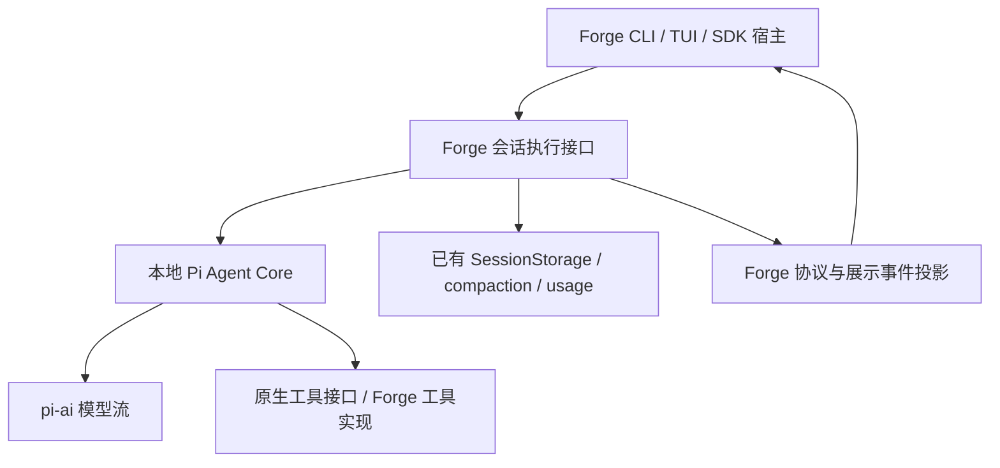

# Pi Core 源码迁移与接入设计

> 状态:本地实现完成，待交付审核(2026-09-08)。正式需求、任务范围及验收定义见 [Spec #14](https://github.com/L-1ngg/forge-agent/issues/14)；本文维护施工接合与回退设计，执行证据见[迁移验收](pi-core-migration-acceptance.md)。

## Why

以固定 Pi Agent Core 源码建立可验证、由 Forge 本地维护的执行底座。保留 Forge CLI/TUI 和已完成的上下文工程，允许为清晰接口修改 SDK、工具与协议消费者。方向见 [ADR-015](../decisions/015-pi-core-source-migration.md)，历史差异依据见[调研方案](../research/pi-core-alignment-plan.md)。

## Entry Criteria

| 检查 | 通过标准 | 不通过怎么办 |
|---|---|---|
| 源码来源 | 固定 SHA、必要源码闭包与许可可复核；不能使用本机另一 Pi checkout 的 HEAD | 先补来源核对 |
| 执行入口 | 明确标准 Agent/loop，不混入 AgentHarness | 停止扩大闭包，重新确认需要的入口 |
| 接口与行为 | SDK/协议签名可变；输入归属、存储故障和上下文接合点有具体映射 | 形成场景与接入方案，不先修改行为凑测试 |
| 基线 | 核对当前 HEAD/用户改动；研究时为 `34a5ebff17bbc77606c31c728f98a079de140ea2` | 保留用户改动，针对变化更新设计 |
| 依赖 | 同源 Core 所需 pi-ai/API 可编译运行；保留并重新验证 Responses patch | 将必要依赖升级放入独立可审查批次 |

## 模块职责和调用链

以下是实现落点建议，不是已导出的公共接口承诺。沿用现有 workspace 与 Bun 工具链，不为本次迁移先拆新发布包。

| 模块 | 拥有的状态与职责 | 接口方向 | 建议路径 |
|---|---|---|---|
| 本地 Pi Core | 活动模型/工具执行、messages、流中消息、pending tools、steering/follow-up、loop 事件 | 保留上游 Agent/loop/types 与生命周期；不 import Forge session、权限总线或 TUI | `packages/core/src/runtime/`，保留 `agent.ts`、`agent-loop.ts`、`types.ts` 等上游文件结构 |
| Forge 会话执行 | invocation 归属、保存/故障、上下文策略、配置生效边界、会话级重试和 idle | 一个 SDK facade 装配 Core；外部指令与观察均由此进入 | 整理现有 `agent.ts`、`agent-runner.ts`、`sdk.ts`；不预设旧三层全部保留 |
| 模型适配 | 认证、模型目录、pi-ai 流、provider 字段转换与补丁 | 注入 `streamFn`；provider 类型停留在 runtime/模型接入处 | 拆清当前 `pi-port.ts` 的模型职责 |
| 工具接入 | 参数准备、权限、实际工具、content/details/update | 以原生工具接口为内核契约，既有实现迁到该接口；确有外部兼容需求才留适配 | `packages/tools/src/types.ts` 与 Core 装配 |
| 事件投影 | 将 Core 事件和会话事件变成 Forge 展示/传输协议 | 转换一次；不通过展示协议反向恢复 Core transcript | protocol 定义与 Core 的单一投影模块；CLI/TUI 同批调整消费者 |

一份运行上下文由 Core 拥有，一份完整持久历史由 SessionStorage 拥有。两者通过压缩/恢复投影连接，本来就不同；避免会话 facade 再维护一份需要逐事件追平的完整 Core state。宿主草稿与 Core 已接受输入也要区分，不能把它们混成两个自动续发队列。

## 接口设计约束

### Core 生命周期

原样基线保留 Pi 的 `prompt`、`continue`、`subscribe`、`abort`、`waitForIdle`、队列模式及 state 语义。其具体签名来自固定源码，不重新发明同义接口或依靠旧版 API 记忆。`agent_end` 不等于已 idle；Core await 内部 listener，外部 UI 观察不作为持久化栅栏。

### 对外 SDK

SDK 保留 Forge Agent 品牌、`@forge-agent/core` 包、`@forge-agent/core/sdk` 入口和 `createAgent`；提供创建与装配、发起/继续、观察、steer/follow-up、取消与等待、compact、配置、释放这些明确能力。可以采用 Pi 的清晰命名与生命周期，但“低层一次 Agent run”和“包含重试/压缩/落盘的会话执行”必须区分。

先将 `AgentPort`、`AgentRunner`、`HostedAgent` 的每项状态分配到上表，再确定最终签名；不因类已存在就逐层保留。旧 `runTurn` 名称、`symbol` 参数和迭代器形状均不是硬约束，但替代接口须仍能识别当前 invocation、拒绝迟到干预，并让宿主知道已接受输入是否被消费。用户已允许接口变更，不以保留旧签名作为阻碍；也不为调用方式变化创建持久 Run/Step 系统。

公共事件的结束、成功、失败、取消、空闲必须有可区分含义。模型失败不能只靠 Promise resolve 当成功；缓冲终态不得使下一次执行收到旧干预。暴露 Core 可变 state 与接受宿主配置应有明确入口，不能让调用者随意改变正在运行的模型/工具而绕开 usage 失效。

配置时序已由 operator 确认，见 [ADR-015](../decisions/015-pi-core-source-migration.md#会话能力范围确认)：空闲时应用，执行中接受后在完整模型响应/工具批次结束与下一轮模型请求之间应用。实现需区分接受与生效反馈，并将配置快照的替换和 usage 失效放在同一受控边界；具体场景与验收以 [#23](https://github.com/L-1ngg/forge-agent/issues/23) 为准。

### 工具与权限

迁移必须接通原生 `content`（text/image）、`details`、progress、prepare/before/after hooks、execution mode。展示数据不再自动 JSON 化成模型文本；协议如需补结构化字段，同步修改 CLI/TUI 和会话转换。

Pi 的 `prepareArguments` 是同步的，`beforeToolCall` 不提供通用 args 替换返回值。现有 Forge async rewrite 不能假装直接等价映射：要么用局部工具适配完成最终准备并保证授权参数就是执行参数，要么调整公开 rewrite 接口及调用方；禁止只检查原始参数而执行重写后参数。具体选择以是否仍需异步 rewrite、现有真实消费者及测试为据，不创建同时有效的两套改写链。

工具接口迁移不自动要求改变四工具的全部文件/进程行为。Pi 的 edit 多区块、write mkdir、bash timeout 等研究结论作为后续可选改进，除非本次接入确实需要，否则保留当前行为。工具截断继续遵循 ADR-014。

### 已有上下文与可靠落盘

会话层覆盖首次 prompt 前准备、工具续轮前准备以及结束后恢复；不能只接 `prepareNextTurn` 而漏首轮。保留摘要算法/参数、usage 失效、手动 compact、会话历史与请求投影的既有语义。

持久化通过内部可等待的消息结算点进入。Pi 先改变内存 state 再 await listener，因此存储失败需在 Forge 会话层停用实例并阻断新效果；异常路径不能再对同一失败存储进行无界追加。UI 订阅不承担保存责任，也不把每个慢消费者变成执行锁。

接入时优先验证两处已知冲突：`length + tools` 在原样 Pi Core 会生成错误结果并可能续轮，Forge 当前先判恢复且不产生这组工具结果；`deferred` 在普通 Pi Core 没有专用驱动分支，Forge 当前将它作为终态。原样 Core 基线必须体现 Pi 行为，Forge 最终会话接入则要明确在哪个 hook/模型适配点截获。若现有 hooks 不足，提交最小 Core 定制并单独验收，不能静默改掉 ADR-014 或降低基线对照要求。

普通任务 retry 参考 Pi AgentSession 的策略放在会话层；和摘要 retry、overflow/length 恢复分开计数。不会为得到重试而引入整个资源/扩展框架，也不会在 provider 与会话层同时叠加默认重试。

## Batches

| 批次 | 输出与验证 | 依赖 |
|---|---|---|
| M0 同源基线 | 复制必要 Core 源、许可、来源说明及对应测试；必要依赖/构建适配逐项列明；差分比较基础运行轨迹 | Entry |
| M1 接入接口 | 在现有五包中完成会话 facade、工具/模型装配、单一事件投影；SDK/CLI/TUI 调用点一起迁移 | M0 |
| M2 会话接合 | 现有上下文、存储、权限、输入身份、取消/释放接入；必要的 Core 差异独立列明，完成受影响合同验证 | M1 |
| M3 替换与交付 | 生产切到本地 Pi Core，删除被替代循环与无职责转发；补会话 retry/选定配置接口，完整检查、文档及消费者同步 | M2 |

具体任务见父规格的 [GitHub 子任务](https://github.com/L-1ngg/forge-agent/issues/14)：同源基线 [#15](https://github.com/L-1ngg/forge-agent/issues/15)，文本会话 [#16](https://github.com/L-1ngg/forge-agent/issues/16)，工具执行 [#17](https://github.com/L-1ngg/forge-agent/issues/17)，结构化结果/进度 [#18](https://github.com/L-1ngg/forge-agent/issues/18)，输入与生命周期 [#19](https://github.com/L-1ngg/forge-agent/issues/19)，手动压缩 [#20](https://github.com/L-1ngg/forge-agent/issues/20)，自动压缩/恢复 [#21](https://github.com/L-1ngg/forge-agent/issues/21)，任务重试 [#22](https://github.com/L-1ngg/forge-agent/issues/22)，配置更新 [#23](https://github.com/L-1ngg/forge-agent/issues/23)，CLI [#24](https://github.com/L-1ngg/forge-agent/issues/24)，TUI [#25](https://github.com/L-1ngg/forge-agent/issues/25)，最终收敛 [#26](https://github.com/L-1ngg/forge-agent/issues/26)。任务状态、具体 AC 和阻塞边以 GitHub 为准；M0–M3 为总体施工阶段，不替代任务依赖。

M0 与接入改动保留独立提交边界。迁移期可以并存测试对照，最终只有一个生产执行器。实施批次需要提交时遵循对应授权，不把本地设计整理视为推送/发布授权。任务级规格、状态和依赖仍归 GitHub Issues；整体验收定义以 Spec #14 为准，本文引用其出口编号。

## Acceptance Criteria / Release

整体验收定义已由草稿迁入 [Spec #14 / Acceptance Criteria](https://github.com/L-1ngg/forge-agent/issues/14#acceptance-criteria)，本文不重复维护 checkbox 或任务状态。M0 对应 AC-MIG-01/02，M1–M2 对应 AC-MIG-03/04/05/06/09，M3 汇总 AC-MIG-01 至 AC-MIG-10 的新鲜证据及未测边界。项目发布与回退还需满足本施工图的 Entry、Rollback 和 SOP 要求。

复制成功、仅 typecheck 通过、旧 Forge 测试通过都不能单独作为出口。核心复现不宣称 Pi 应用、插件或 SDK 全生态兼容。

## Rollback / Risk

原样基线、接入及生产切换分别可审查/回退，源码与依赖/协议消费者保持匹配版本。优先保持现有 session 格式；如结构化工具结果确需改变保存格式，先另定副本迁移，不原地覆盖用户会话。回退不会撤销工具副作用或已写入数据，不长期保留双引擎开关。

主要风险是保存与终态调用点迁移、上游异常传播、工具参数授权错位，以及 pi-ai 升级/补丁兼容。以受控模型流、存储 gate、工具 effect log、HTTP/PTY 验证；真实 provider 与跨平台未测项保持如实记录。

## 当前验证

本轮修改仅为设计文档和导航；检查本地引用及 whitespace，不重跑未变更的产品测试。此前 55 项基线及源码研究见[调研验证](../research/pi-core-alignment-plan.md#今晚的验证与局限)，不能标为本施工图已完成的验收。

## 实际模块落点

- `runtime/Agent`：唯一生产循环、临时请求消息、工具调度、原生事件和状态归约；基线与定制见 `packages/core/src/runtime/README.md`。
- `agent-session.ts`：完整持久历史、awaited 保存、输入消费回执、usage、压缩/恢复、任务 retry、配置应用边界。
- `pi-port.ts`：模型与认证装配、工具串行准备/授权、结构化结果持久化校验；`event-projection.ts` 投影协议及现有展示块。
- `agent.ts` / `sdk.ts`：宿主 invocation 身份、惰性迭代消费、取消/释放和公开出口。旧 `ExecutionCore`、`AgentRunner`、临时双工具协议及权限转发桥已移除。
- `packages/tools`：一个 `HarnessTool`，返回 `ToolResult`；内置文件/进程操作的 `ToolOutcome` 只在实现内部转换，不是第二套 SDK 工具协议。

具体签名与宿主升级示例统一见[中文 SDK](../sdk.md)及[英文 SDK](../sdk.en.md)。当前版本取消时可能保存上游生成的 aborted assistant，以及已准备但未执行调用的错误结果；这不表示新模型请求或工具执行，重开过滤这些响应且不重放效果。
