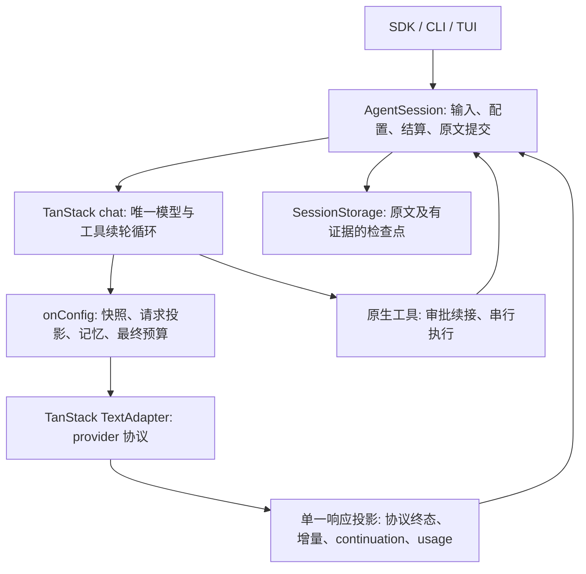

# TanStack 单 Agent 基座重构

> 状态:本地实现与当时离线验收已完成，外部验收未完成(2026-09-27)；工具预执行及并行选择被 [Issue #39 施工图](native-tool-approval.md) 取代，响应收集器职责被 [Issue #40 施工图](model-response-boundary.md) 取代。本文保留当时施工与验收边界，当前决策见 [ADR-027](../decisions/027-native-tool-approval-and-interruption.md) 和 [ADR-028](../decisions/028-model-response-boundary.md)。

> 合同更新(2026-10-01):执行前/逐工具保存屏障、通用改参链及审批修订日志被 [ADR-030](../decisions/030-native-arguments-and-conversation-persistence.md) 部分取代；本次施工与证据见[会话中间件简化](session-middleware-simplification.md)。本文保留当时实现与验收记录。

## Entry

起点 `1336da5ff869f08df37959f01eb353f6c8d9dc96`。当时保留启动前 `docs/research/README.md` 与 `docs/research/tanstack-ai-opportunities.md`，后者现见[历史研究](../archive/research/tanstack-ai-opportunities.md)；本地原文副本位于 `review-notes/foundation-baseline/`。用户数据、会话和配置不自动迁移；初始交付限定本地工作区，operator 在完成离线验收后明确授权本地 commit。不 push、发布或修改远端任务。

基线 frozen install、依赖/五包/automation/test/example 类型检查通过。Linux network-namespace 下 contract 558、integration 378、CLI/PTY 14，共 950 pass；headless 通过。首轮 contract 误收本次下载发布包内的测试并失败，移入研究目录的 node_modules 后重跑通过；不视为产品已有失败。实际命令和日志见验收记录。

## 职责与状态

启动时链路：`createAgent → HostedAgent → AgentPort/createSessionPort → AgentSession → RuntimeAgent → Pi agent-loop → StreamFn → TanStack adapter.chatStream`。消息经过 `SessionMessage → Pi Message → ModelMessage` 两次转译；SDK、会话和 runtime 分别持有运行生命周期。工具授权缓存和 runtime 工具准备重复；压缩重写 runtime 请求历史。

目标链路：

- `AgentSession` 独占输入归属、配置 revision、存储状态与 invocation 的权威结算。`AgentTurn.result` 由执行结果结算，不再从展示事件反推。
- TanStack `chat()` 独占工具后的模型续轮。Forge 外层只在新排队输入、有限供应商重试、上下文恢复时启动新的 chat run，不再维护第二个工具循环。
- 每次 `onConfig(beforeModel)` 捕获一个配置快照，准备 canonical `messages` 与独立 `providerMessages`；系统、工具、摘要与该响应工具批次共同使用快照。提交存储后才允许下一请求。
- 公开模型接缝改为 TanStack 原生 `adapter`，类型为 `AnyTextAdapter`；对象模型须提供 adapter；字符串模型可覆盖 adapter，`adapter: null` 恢复内置目录传输。删除 `StreamFn`、Pi Message/EventStream 和默认流包装，不提供旧接口兼容层。
- `SessionMessage` 保留为历史/展示领域格式和原有 JSONL 数据边界；只在模型请求与响应处同 TanStack 转换。MCP 快照、工具 details、证据身份并非普通 ModelMessage，不能静默丢弃。
- 工具提案先由 Forge 准备、严格校验并按最终参数判权；原生 `needsApproval` 仅将 `ask` 交宿主，整批决定收齐后续接。TanStack `.server()` 串行执行获批工具，Forge 在每项执行后提交结果；当前详细合同见 [Issue #39 施工图](native-tool-approval.md)。
- provider 流在同一个响应收集器中验证终态、参数 JSON、thinking signature 与 usage。半截响应与 unknown finish reason 失败；length 不启动任何工具。传输重试为零，会话重试有界且不会重做已提交工具。
- 压缩检查点只在 SessionStorage 持久化。请求投影从当前分支重建，middleware metadata 不保存任务状态。最终预算在宿主变换和记忆注入后检查 system、tools、messages、output、margin。

## 全仓处置清单

以下各项已完成实现、迁移或有证据的保留；没有本次待实施批次。实际验证和外部边界见[验收记录](tanstack-foundation-acceptance.md)。

| 模块 | 处置 | 原因 / 完成标准 |
|---|---|---|
| runtime/Agent、agent-loop、runtime 类型 | 替换并删除 | chat 唯一工具续轮；删除 Pi 生命周期与通用状态机 |
| HostedAgent、AgentPort、session-port | 合并 | AgentSession 直接实现 SDK；装配无第二生命周期 |
| model-types/stream、openai-stream、tanstack-stream | 替换/简化 | 原生 adapter/chunks；只保留目录元数据与一处历史转换 |
| provider adapters/auth/catalog | 简化/保留 | 原生 adapters；保留 37 provider 的认证、路由、价格/预算元数据及有回归约束的 Bun Bedrock 补足 |
| session-configuration | 简化 | adapter 配置快照和摘要共享请求机制；无流函数封装 |
| session-tools/tool-arguments | 合并调度职责 | 一次最终校验与授权快照；移除授权 Map、重复结果构造与旧 payload schema 修补 |
| context/* | 简化生命周期、保留证据算法 | onConfig 统一请求投影；压缩不维护 runtime messages；证据/分支/完整预算无第三方等价 |
| session-storage/store/search | 保留数据层、接线简化 | JSONL 分支和逐条 durable append；删除 asStorage 转发包装，直接传 SessionStore；副本验证旧格式，无真实数据变更 |
| memory/* | 保留 | Markdown 文件版本、来源、worktree继承与显式写入合同；ai-memory 自动抽取及存储语义不同 |
| skills/* | 保留语义、简化解析 | 三层优先级、禁用、显式调用、忽略/符号链接/取消及修订快照；删除重复 frontmatter/text 拆分，直接使用 yaml；ai-skills尚无等价 |
| mcp/* | 保留官方 SDK v2 | 连接/凭据/权限/资源/提示/订阅/OAuth/elicitation；ai-mcp v1 wrapper需要第二客户端才能覆盖 |
| protocol | 保留领域合同 | SessionEvent、TurnResult、请求总线为宿主/UI合同；不泄漏 TanStack 执行成功判断 |
| tools | 使用 TanStack schema + toolDefinition 接线 | 工具实现保持 cwd、signal、details，与执行内核无耦合 |
| cli、tui | 迁移装配及类型 | 同一SDK链路；UI只消费权威result；PTY验证 |
| examples、测试、脚本、依赖、文档 | 全部迁移 | 删除旧接口专属测试，行为测试移到SDK/native adapter；中英文同步 |

## 选型及自审

当时选择 A：隔离原型通过 beforeTools 预调度和 native execute 等待结果实现过并行 maxActive=2、授权参数一致及提交屏障。Issue #39 后放弃预调度与并行，采用原生审批和串行执行；这段原型结论仅解释当时选择，不构成当前运行保证。无工具 stop 后的新输入仍由会话启动新 chat run，是输入调度而非第二个工具循环。

不采用 ai-compaction 0.1.9、ai-persistence 0.6.7、ai-mcp 0.4.6、ai-skills 0.1.11、ai-memory 0.2.6；比较的是围绕原生接口重设计后的整条链，具体发布源码、实验、能力差异见 ADR 和验收。保留现有 provider patches：latest 与锁定版本相同，无已发布替代修复证据。

自审重点：不得把旧内核装进 adapter；不得因 native 终态成功忽略存储/协议失败；不得以 canonical transcript 或 middleware metadata 新建第二份可恢复状态。当前串行及审批续接按 Issue #39 的 SDK、HTTP 与 PTY 验收。

## 接口与数据迁移

宿主把 `streamFn` 改为原生 TanStack `adapter`。任务与摘要使用同一个 adapter 接缝和信号。工具 hooks 使用 SessionMessage/ToolCallBlock，不再接触 Pi AgentContext。仓库所有调用方、测试夹具、示例、中英文指南一次迁移。配置类型统一为 `CreateAgentOptions`，移除同义 `AgentOptions`；存储直接传 `SessionStore`，删除 `asStorage()` 转发方法。旧参数显式拒绝，不让多余 JS 参数悄悄使用真实内置传输。

JSONL schema、Markdown和MCP附件格式保持；只读版本解析继续兼容已保存数据。在临时副本恢复并追加、检查原文和continuation及checkpoint，确认原始副本来源未变。内部实现和SDK同时回退，不自动转换真实数据。

## Acceptance Criteria

- [x] AC-1：原生 chat/toolDefinition/middleware 已在生产链；Pi循环、冗余生命周期/消息类型和旧模型接缝已删除。
- [x] AC-2：输入processed、steering/follow-up、五类终态/策略停止、取消、idle/dispose与配置accepted/applied通过SDK行为验证。
- [x] AC-3：当时的严格最终参数、权限、并行/串行、before/after 干预、取消及存储屏障覆盖；当前执行保证按 Issue #39 重新验收。
- [x] AC-4：所有内置协议本地HTTP fixture覆盖增量/工具/usage/continuation/终态/失败与摘要；自定义native adapter覆盖任务和摘要。
- [x] AC-5：原文、检查点来源与分支、压缩失败/预算/存储故障、旧数据副本恢复、MCP/Skills/记忆行为通过。
- [x] AC-6：frozen install、check、typecheck:examples、test:headless通过；受影响PTY通过；反向验证能发现破坏。
- [x] AC-7：处置清单全部完成，最终审查问题修复，README/SDK双语和当前合同同步，启动与迁移方式可复现。

真实供应商矩阵、跨平台、长期质量/费用和人工验收单列；没有本次明确预算不调用真实模型，不作为本地软件通过的替代证据。

## 回退与风险

本次本地改动按设计/核心/调用方/测试文档可审查；回退使用启动SHA与本次diff逐项恢复，不执行hard reset/clean，不覆盖启动前用户文档。不存在新旧循环并行开关。最主要风险是 native chat 生命周期与持久化/取消交错；以屏障fixture、多协议矩阵和反向验证覆盖。第三方0.x升级需要重新核对工具阶段与provider补丁。
