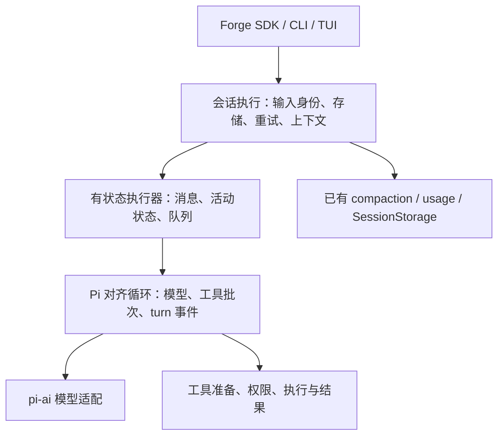

# Pi 内核高保真对齐：调研与待确认方案

> 状态:调研记录(2026-09-08)。operator 后续明确采用源码移植并允许接口调整；当前方向见 [ADR-015](../decisions/015-pi-core-source-migration.md)，接入设计见[迁移施工草稿](../phases/pi-core-migration.md)。下文差异、路线比较与验收候选保留为研究依据，不覆盖后续范围收敛。

## 当前结论与设计入口

本项目已经具有 Pi 风格的模型—工具循环、steering/follow-up、消息事件和上下文管理，但**尚不是 Pi 内核的高保真复现**。差距主要在工具准备/调度、可等待事件、通用扩展接口、普通任务重试、状态与继续执行接口，以及工具结果表示；不只是文件命名或类结构不同。

operator 已在调研后的对话中选择：先复制 Pi Agent Core 源码、建立本地拥有的复现基线，后续再定制；本项目 CLI/TUI 保留，SDK/协议等接口允许随迁移改变。详细原话及方向只维护在 [ADR-015](../decisions/015-pi-core-source-migration.md)，不再把“是否直接依赖 npm Agent”或“是否严格兼容旧 SDK”作为待重复询问的问题。

当前建议基准仍为标准 Pi `Agent + agent-loop` 的 `9767ba2`，会话接合参考 AgentSession。当前接入范围与接口设计见[迁移施工草稿](../phases/pi-core-migration.md)。旧循环仅作为行为参考和回退依据；不是继续逐项改造的主体。工具接口迁移与完整工具功能复制分开，原研究中建议对齐的 edit/write/bash 功能不自动成为此次必做项。

## 原始需求与研究边界

operator 在 2026-09-08 对话要求：

> 我现在想要让本项目的agent内核设计对齐pi的内核设计，或是相同，（高保真还原）
> 然后关于上下文工程的我已经对齐了。其余的也要对齐，然后我现在要睡觉了，所以想要设置一个Goal，先调研好方案。由我明天确认后再施工

本次 Goal 的出口是可审查的研究方案，**不是实现完成**。只新增本地研究及跨 session 交接文档；没有修改生产源码、配置、依赖、现行决策、用户数据或远端状态。项目已配置 GitHub tracker、triage 与 single-context，无需重复执行 skill setup。`ask-matt → research → operator 决策 → 规格/施工设计 → 任务拆分 → implement` 是本次路线；睡前不强行开展访谈，也不把研究自动变为施工。

## 固定基线与证据层级

| 对象 | 基线与用途 |
|---|---|
| Forge | `34a5ebff17bbc77606c31c728f98a079de140ea2`；开始时 `git status --short` 为空 |
| Pi | [`9767ba275f3e9a5ee0f5c5342249b629ab1b2282`](https://github.com/earendil-works/pi/tree/9767ba275f3e9a5ee0f5c5342249b629ab1b2282)，与 ADR-014 相同；独立临时 checkout 核对，不使用本机其他 Pi 工作区的 HEAD |
| 模型依赖 | Forge `pi-ai 0.84.4` + Responses 终态 patch；目标源码包版本 `0.85.1`，版本数字不代表源码相同 |
| 既有上下文结论 | [ADR-014](../decisions/014-pi-aligned-context-management.md)、[验收记录](../phases/context-management-acceptance.md)；已有自动化和受控真实任务证据，不将历史结果当作今晚的新测试 |
| 上游语义依据 | [基础循环研究](pi-core-upstream-semantics.md)：逐项源码 permalink、默认值、可选分支、分发基线 |
| 接入依据 | [工具与宿主接入研究](pi-core-integration-surface.md)：工具结果、动态设置、provider、扩展与会话能力 |

下文 Forge 路径均相对于上述固定 commit。源码说明“实现是什么”；测试说明“这些案例实际发生什么”；推荐方案与未来 AC 均不是已实现事实。当前 GitHub open issue 查询为空；历史上下文规格仍通过 #2 及验收记录引用，本次未创建新任务。

## 要对齐的是哪一层

Pi 的 Agent 负责执行状态、循环和工具；AgentSession 负责完整会话执行，包括持久化、压缩、重试、扩展接入和空闲判定。`coding-agent/src/core/sdk.ts` 实际装配 `new Agent` 与 `new AgentSession`。同一快照新增的 `packages/agent/src/harness/` 不是这条入口，不能同时抽取两套默认行为后称为“Pi 的原样设计”。参见[上游研究](pi-core-upstream-semantics.md)。

当前 Forge 的 `ExecutionCore` 同时包含循环、历史/存储、usage 与自动/手动压缩；`pi-port.ts` 同时包含模型转换、工具权限、工具调用和展示事件装饰；`HostedAgent/AgentRunner` 管理公开迭代器、输入身份与释放。现有接口能用，但职责与 Pi 有明显差异。[ExecutionCore](../../packages/core/src/execution-core.ts)、[pi-port](../../packages/core/src/pi-port.ts)、[SDK 装配](../../packages/core/src/agent.ts)。

建议最终结构如下，名称仅为职责说明，不要求新增同名公共类：



避免仅把大文件拆小却留下两份 messages/queue/faulted 真相。公开调用仍跨现有 SDK 接口；内部通过可替换模型流和工具执行依赖运行固定场景。上下文算法继续使用当前实现，通过明确且可等待的调用点接入。一个执行器服务所有宿主，不长期保留双生产引擎。

## 核心差异与处置矩阵

“对齐”指在选定范围内复现源码可观察语义；“保留”必须列为明确例外，不计入完全等价。

| 维度 | Pi 固定快照 | Forge 当前与影响 | 推荐处置 |
|---|---|---|---|
| 循环/会话分层 | Agent/loop 与 AgentSession 分责 | ExecutionCore 同时持有 storage、compaction、usage | 移出会话策略，保留已有算法；先锁事件/保存调用顺序 |
| prompt / continue | 可提交 AgentMessage/图片；continue 不伪造新 user | SDK `runTurn(string)`，没有公开 continue；图片历史转换已支持 | 内部增加同义的 prompt/continue 路径；公开输入能力以 D2 确认，禁止用空 user 冒充继续 |
| 状态 | messages、streamingMessage、pendingToolCalls、errorMessage、isStreaming | messages 与 controller 私有；消费方从协议事件推导 | 以 Pi 状态更新时序形成内部状态；不要把可变内部引用直接泄漏给 SDK |
| 工具策略 | 默认 parallel；任一工具 sequential 可使整批串行 | `Promise.all(calls.map(...))`，无调度选择 | 增加同义策略和工具声明；验收有依赖的写/读顺序 |
| 并行准备 | 调用顺序逐个 prepare/validate/before hook，准备完再并行 execute | 每个 execute 内自行校验/重写/权限；第一项可在第二项准备结束前执行 | 改为准备阶段 + 执行阶段；并行仅发生在执行阶段 |
| 参数准备 | `prepareArguments` 在 schema 校验前；before hook 接收校验后的 args | validate → async rewrite → validate → permission → execute | 保留既有 rewrite 适配；新增 Pi 等价准备点，授权始终观察最终参数，说明两者关系 |
| 工具结果 | 原生 content（text/image）、details、可选 terminate | `ToolOutcome` 被 stringify 成单个 text；details 主要用于展示 | 内核采用结构化结果，旧 HarnessTool 经适配；不能误把图片 bytes 或宿主 details 塞给模型 |
| 工具 progress | execute update callback，等待已发 update，结算后抑制迟到更新 | 协议已有 `tool_execution_update`，HarnessTool 无对应回调生产链 | 补完整调用链，保证 update 在 end 前；保持模型最终消息语义 |
| 工具 hooks | before/after、结果修改、阻断/terminate、shouldStopAfterTurn | 仅重写/权限及失败返回，宿主不能完成同等干预 | 实现运行语义所需 hooks；扩展发现/安装属于更外层 |
| batch terminate | 所有已结算结果 terminate 才停止工具续跑；仍区分 steering/follow-up | 当前同类逻辑，已有全部拒绝/混合权限测试 | 保持并加入同源对照；不改成任一拒绝就全局停机 |
| steering/follow-up | 默认各 `one-at-a-time`，可 `all`；完整 batch/turn 后检查 steering，空闲边缘检查 follow-up | 当前两条 FIFO 固定一次一条；同样在 batch 后处理 | 对齐 mode 与精确 poll 时点；保留 invocation 身份和 processed 回执 |
| 事件回调 | Agent 先归约状态，再依序 await listener；agent_end 完成后才 idle；AgentSession 外部观察者不 await | 异步迭代器外侧消费不阻塞运行；内部 append 是等待点 | 内部可等待事件通道与外部观察分开；不能把慢 TUI 变成所有工具的隐式锁 |
| 事件载荷 | message_update 包含消息/底层 delta；turn_end 带 assistant 和 results，agent_end 带新消息 | Forge 增量协议、turn_end 仅 stopReason；外层另有展示 blocks | 内部保真、公开映射；若 D2 要原始 Pi 载荷，按接口变更独立批次 |
| 普通模型临时失败 | AgentSession 默认最多三次重试，2/4/8 秒，排除 overflow；保留历史失败、移出运行上下文再 continue | 任务 stream `maxRetries:0`，普通 error 直接结束；顶层 retry 当前只驱动摘要 | 新增会话层任务重试，复用策略但分清计数器；不要叠加 provider 重试导致请求数量倍增 |
| error/aborted | 基础 loop 直接 turn_end/agent_end，不调工具 | 当前同样不调工具，历史保存/请求过滤由已有工程负责 | 对齐基础语义，保持取消不启动新工作、存储故障停用 |
| length + tool calls | 不执行；基础 loop 生成逐调用错误结果，可能再续一轮 | 当前不发工具事件/结果并终止；可恢复 length 先走 ADR-014 压缩 | **与已批准上下文/保存边界相交**：默认保留现行为并显式例外；改成 Pi 需重批 ADR-014 对应条款 |
| deferred | 基础 Agent 无专用恢复分支，新 Harness 有不同处理 | Forge 将其当作终态且退回未处理输入，无持久 deferred 恢复载荷 | 保留当前行为为例外；不能借高保真偷偷新增后台任务恢复系统 |
| 取消/释放 | AbortSignal，waitForIdle；Agent 级 abort 不自动清队列 | Forge 普通停止清当前 invocation 队列并回执，SDK 等待工具/存储收尾 | 按 ADR-010/014 保留宿主语义，新增内部取消时点对照 |
| 配置与上下文投影 | transformContext → convertToLlm；可调整 model/system/tools/thinking 等 | 固定模型/工具装配，项目自有 projectMessages 与 usage identity | 对齐运行接口时维持投影顺序；动态变更在受控边界生效并使 usage 失效 |
| 持久化 | coding-agent handler 参与可等待事件；SessionManager 为应用实现 | Forge await SessionStorage.append，失败停用；v4 会话 | 保留存储合同，不改成旁路 fire-and-forget，不承诺 Pi JSONL 兼容 |

本表事实的上游逐行证据见[基础循环研究](pi-core-upstream-semantics.md)和[接入研究](pi-core-integration-surface.md)。Forge 主要依据为 [execution-core.ts](../../packages/core/src/execution-core.ts)、[pi-port.ts](../../packages/core/src/pi-port.ts)、[agent.ts](../../packages/core/src/agent.ts)、[工具类型](../../packages/tools/src/types.ts)、[事件协议](../../packages/protocol/src/events.ts)。

### 已有上下文工程的保护面

不重新选压缩阈值、摘要结构、摘要 retry、Read/Bash 限额、日志生命周期或存储格式。迁移仍须复验它们与新循环的接合点：每次请求前检查、工具 batch 中不压缩、消费输入/assistant/工具结果的保存顺序、overflow/length 一次失败链恢复、手动 compact 等待空闲、usage 失效。

“保留已有算法”不等于这些路径不会回归。尤其 `prepareNextTurn` 不覆盖第一次请求，不能只把现有前置压缩移入该 hook 后漏掉首轮。Pi 的 AgentSession 还有 prompt 前准备逻辑；Forge 的会话执行层必须同样覆盖入口与续轮。

另有一个措辞需要施工前澄清：[ADR-014](../decisions/014-pi-aligned-context-management.md) 表中称摘要使用“当前主模型、路由及重试策略”；当前 SDK 文档具体承诺的是摘要重试，普通任务并没有对应重试循环。不能据此宣称普通任务 retry 已对齐。新增任务 retry 正属于本次其余内核能力，而不是重做摘要算法。

### “其余”也包括哪些外围差异

高保真内核必须容纳 Pi 式工具结果、进度、hook 和动态配置；缺少这些能力会限制相同循环的用途。内置工具的 schema、文本和 edit 匹配策略也会改变模型行为，应在后续工具批次对照，不能因 Read/Bash 截断已完成就标整套工具已相同。

但 `grep/find/ls`、skills/extension 发现加载、slash commands、完整 session 树导航/分支总结、模型选择 UI、RPC/JSON 模式、Pi TUI 和包管理属于更外层产品能力。它们已纳入[接入清单](pi-core-integration-surface.md)说明现状；默认不把整个 coding-agent 应用搬进通用内核。若 D2 选择完整 Pi 应用能力，应扩展规格而非把这些遗漏在“已全对齐”的声明里。Team、RAG、服务发布不因此进入本项目。

## 路线比较与推荐理由

| 路线 | 高保真/维护特征 | 对既有合同的影响 | 判断 |
|---|---|---|---|
| A：本地移植固定 Pi 算法与职责 | 能对齐每个调度/事件分支；未来上游变更需显式同步与差分测试 | 保留 pi-ai 边界、Forge SDK、输入/存储例外；需要重构本地 loop | **在保留 ADR-009 前提下推荐**。不能只凭“参考 Pi 写过”宣称等价 |
| B：直接使用固定 Pi Agent | 基础循环本身来自上游，最少重复维护；适配层仍可能改变行为 | 必须替代 ADR-009，修改 check-deps；保存故障、输入身份、公开协议仍需适配 | 若“相同实现”高于“自有循环”，比重复抄写更合理；不是零成本换包 |
| C：整体采用 coding-agent AgentSession | 会话/扩展能力最接近完整 Pi 应用 | 内置 SessionManager/配置资源/工具体系与 Forge 存储、通用 SDK 深度耦合 | 不作为单内核目标的默认方案；先确认是否真的要完整产品 |
| D：改用新 AgentHarness | 上游提供另一套统一执行/持久化能力 | 与 ADR-014 参照路径不一致；deferred、会话操作等需再调查/重批 | 当前不推荐，不能仅因名字是 Harness 就认为它是 coding-agent 正在使用的内核 |

A 可以移植 MIT 源码，但需要保留许可证/版权及固定来源，准确描述为上游派生的本地实现；代码归本地维护不等于原创。B 也必须固定可复核构建：npm `0.85.1` 的 gitHead 不是本次基准 SHA，但今晚进一步比对官方 tarball 的 `.js.map.sourcesContent`，agent **90/90**、ai **177/177** 均与固定快照一致。因此精确依赖这两个发布包是有证据的候选；该结果不覆盖全部资源、构建产物和传递依赖，不能等同于 Bun/宿主兼容验收。具体分发证据见上游研究。

暂不升级整个 pi-ai。先用现有 `0.84.4 + patch` 检查所需原语与 types 能否承载 A；新增原语若必须升级，另立依赖批次。目标源的 `0.85.1` 包结构与已装版本之间不能仅以 typecheck 判断 provider 行为。**固定目标源码仍没有 Responses completed/incomplete 后的 `break`**；升级应重新制作并验证该补丁，不能直接移除。补丁只有在目标上游已修复且“不等 HTTP EOF”回归通过时才可移除。

## 可施工的批次草案

以下是研究中的批次/验收建议，不是已发布规格或已创建 Issues。批准后按项目分工，把具体任务 AC 放 GitHub Issues，跨批设计放 `docs/phases/`，本文保留研究依据。不要另造一套本地任务状态系统。

| 批次 / 依赖 | 输入与改动位置 | 可审查输出与出口 | 回退 |
|---|---|---|---|
| B0 / operator 决策 | D1–D4、ADR-008/009/010/014、差异矩阵 | 新 ADR（有意替代项明确）、整体施工图、依赖任务规格；每项差异归为对齐/批准例外/后续产品范围 | 文档草稿可修订；未批准不写生产代码 |
| B1 / B0 | 固定 Pi 源与 Forge，现有 loop-contract/SDK 测试 | 建立相同输入的差分 harness 和显式例外清单；无模型网络调用；目标差异先产生可解释失败 | 单独测试提交；上游仅在测试参照环境，不进入生产依赖 |
| B2 / B1 | execution-core、agent-runner、pi-port | 循环/有状态执行器/会话策略分责；内部 await 事件保存点；SDK/上下文行为不变并通过既有回归 | 独立提交回退；无 session 格式变更 |
| B3 / B2 | 工具类型与适配、loop 调度、protocol | prepare→execute 两阶段、parallel/sequential、before/after/terminate/progress、结构化结果；旧工具兼容适配 | 类型/适配/消费者同批交付或有明确兼容桥；不保留双生产调度器 |
| B4 / B2（集成验收需 B3） | 执行器状态、输入队列、事件映射、SDK | prompt/continue、queue modes、精确 turn/事件顺序、终态策略；Invocation 回执/取消例外仍满足 | 回退该接口批次与匹配消费者，不回滚已产生工具副作用 |
| B5 / B4 | 会话执行与已有 retry 配置/事件 | 普通任务 retry、abortable backoff、失败历史与运行上下文分离；不重复 user/已完成工具，不叠加恢复预算 | 单独提交回退；已有摘要重试继续可用 |
| B6 / B3–B5 | SDK 动态装配、工具内置适配、pi-port | 对齐选定的 model/system/tools/thinking 变更与模型工具契约；如需 pi-ai 升级分成独立子批，重验 patch/provider | 锁文件和 patch 与适配同版本回退；不直接改用户会话 |
| B7 / 所有选定批次 | loop-contract、core/tools、SDK、CLI/PTY、双语公开文档 | 差分目标、例外合同、上下文联动、故障反向验证、完整 check；形成绑定最终 SHA 的验收记录 | 保留旧源码/会话副本；无永久兼容引擎，无自动发布 |

B2 不是必须机械创建三套类：以同一状态只有一个 owner、事件/存储/继续调度顺序可单独检验为出口。B4/B5 可在设计上独立推进，但最终故障与取消验证要与 B3 的调度合并后再跑。B6 工具行为改变必须同步模型描述和 TUI blocks；不会因为内核完成自动证明工具高保真。

若 D1 选择 B 路线，B2 改为固定 Pi Agent 适配并调整依赖门禁，B3 主要成为工具/result/hook 适配，B4/5 仍需完成 Forge 宿主/会话合同。B1 与 B7 不省略。若选择 C/D，应先补整体接入调查再批准新的施工图，不能假设替换本表某一格即可完成。

## 高保真验收设计

### 对照方法

两侧输入相同的脚本模型流、工具函数、队列到达时点、取消信号与存储 gate，记录：模型请求消息、有效配置、工具准备/实际启动/结算轨迹、规范化事件、最终消息/状态、持久化条目。使用 barrier 控制竞态，不依赖真实模型恰好做出相同选择。

只规范化时间戳、随机身份和已批准的协议名字映射。不能排序所有事件来掩盖错误次序，不能删掉 failed/aborted/length 消息来凑相等，不能忽略工具副作用次数。并行结束事件可以有非确定顺序；用受控 gate 固定完成次序，或验证源码要求的偏序和结果按调用顺序，不能把两种顺序混为一谈。

若测试参照必须引入 pi-agent-core，单独隔离测试工作区/源码快照，不绕过现有生产依赖禁止规则。版本/来源记录要能复建；参照测试不得通过调用 Forge 自己来制造“上游期望”。

### 待批准的整体验收标准

- [ ] AC-PICORE-01：固定两侧 SHA/依赖与场景集；全部差异有去向，获批范围内没有未解释差异，例外逐条列出而非统一 ignore。
- [ ] AC-PICORE-02：文本/推理/工具参数增量、正常工具续轮、空响应、error/aborted/length/deferred 等轨迹符合目标或已批准例外；continue 不生成重复 user。
- [ ] AC-PICORE-03：parallel 准备顺序、整批准备后启动、sequential override、结果调用顺序、unknown tool/invalid args/hook throw/terminate 均有副作用次数断言。
- [ ] AC-PICORE-04：参数准备与授权对象一致；拒绝/阻断不执行；tool content/image/details 与 progress 正确分离，迟到 progress 不出现在 end 后。
- [ ] AC-PICORE-05：steering/follow-up 两种 mode、首轮/准备期间/batch 后注入，逐项证明消费时点；旧 expectedTurnId 不命中新执行，processed 含义保持。
- [ ] AC-PICORE-06：普通 transient retry 默认三次、2/4/8 秒；永久错误及 overflow 不进入该链，成功重置计数；abort/backoff/dispose/存储失败不启动后续请求，工具副作用不重放。
- [ ] AC-PICORE-07：慢/失败 storage 与模型/工具启动之间有等待栅栏；取消、未启动 iterator、提前 return、agent_end 到 idle、多实例均保持现有 SDK 合同。
- [ ] AC-PICORE-08：上下文既有回归保持；首次和工具续轮均准备上下文；手动 compact 等待空闲；retry 与 overflow/length 计数互不串扰；动态配置使 usage 依据正确失效。
- [ ] AC-PICORE-09：本地 HTTP provider/Responses 终态与 continuation signature 回归、SDK 示例、headless 退出码、真实 PTY 交互、完整 `bun run check` 通过，双语公开文档同步。
- [ ] AC-PICORE-10：至少注入“提前启动工具”“跳过保存 await”“重试重放工具”之一使对应验收失败，恢复后通过；最终记录 Ran / Not run / Why / Risk 并绑定最终 SHA。

AC-PICORE-09 的真实 PTY/HTTP 都是施工出口，不是今晚已经运行。真实 provider 多轮任务需要施工阶段明确受控场景；已有人工验收豁免、源码检查和 fake provider 不算真实供应商等价证明。

## 今晚的验证与局限

**Ran（2026-09-08，Forge `34a5ebf`）：**

```sh
bun test tests/loop-contract/owned-core.test.ts \
  packages/core/test/input-ownership.test.ts \
  packages/core/test/incremental-session.test.ts \
  packages/core/test/compaction.test.ts \
  packages/core/test/responses-terminal.test.ts
```

结果：**55 pass / 0 fail，992 assertions，5 files，Bun 1.3.12**。这是现有合同基线，不是新对齐实现的验收。

文档收尾核对四份新增文件的本地引用、固定上游路径/行号与新增文件 whitespace；修正一处超出源码末尾的引用。最终只留下这四份文档，现有跟踪文件无改动；研究临时 checkout 收尾清理。

另运行两个仅内存工具/faux model 探针（`bun -e` 调用当前 `createPiTestPort`，没有网络模型请求或产品文件修改）：

1. 同一 assistant 调用 a、b；b 的 `toolInputRewrites` 等待 20ms，记录 rewrite 起止及 execute：`prepare-start:a → prepare-end:a → prepare-start:b → execute:a → prepare-end:b → execute:b`。证明当前 Forge a 会在整批准备完之前执行；上游两阶段差异由固定源码另行核实。
2. 脚本响应依次为 `error("429 rate limit exceeded")`、`stop("retry succeeded")`；一次 runTurn 的 `turn_end` 只有 `["error"]`。结合任务流 `maxRetries:0` 及 `ExecutionCore` 终止分支，证明当前没有普通任务层 retry；不把 faux 实验当作真实 HTTP 429 测试。

**Not run / Why：**没有实现新引擎或差分 harness，没有安装/升级生产依赖，没有运行完整 check、所有 PTY 或真实 provider；本次是方案研究，针对现有保护合同运行了相称的自动化，完整出口留待施工。没有发布新 ADR、GitHub 任务、提交或推送。

**Risk：**所有高保真结论只对固定快照成立；上游相同版本号不保证同 SHA；保留 Forge SDK/上下文例外意味着不能宣传“整套 Pi 完全兼容”。结构分层会移动现有保存/取消调用点，是主要回归风险。模型回答质量和长任务成功率不能由调度等价自动推出。若明天基线发生变化，应先核对差异再更新方案，不覆盖 operator 改动。

## 恢复工作

跨 session 的最短入口见[迁移交接](../../review-notes/2026-09-08-pi-core-alignment-review-request.md)。方向已进一步收敛，按 ADR-015 和迁移施工草稿继续对齐接入设计，不重新询问旧 D1–D4。研究 Goal 完成不代表施工 Goal 已开始，远端操作仍需对应授权。
